<h1 align="center">Docker Swarm</h1>

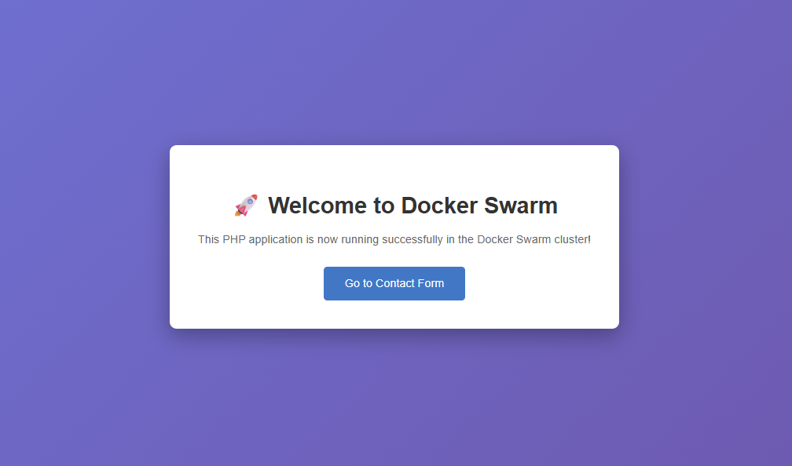

<p align="center" style="font-size: 20px; color: black;">
  <strong>GitHub Repo:</strong>
  <a href="https://github.com/91maxore-hub/docker-swarm-app" style="color: black; font-weight: bold;">
    https://github.com/91maxore-hub/docker-swarm-app
  </a>
  <br><br>
  <a href="https://wavvy.se" style="color: black; font-weight: bold;">
    https://wavvy.se
  </a>
</p>

I detta projekt har jag byggt en skalbar och robust miljö för en webbapplikation med Docker Swarm på AWS. Miljön består av tre virtuella EC2-servrar, där en fungerar som manager och två som worker-noder. Applikationen, som är utvecklad med HTML, PHP och CSS, körs i tre separata containrar – en på varje server – vilket ger hög tillgänglighet och enkel skalning.

För att hantera inkommande trafik och säkerställa säkra anslutningar har jag implementerat Traefik som reverse proxy med stöd för HTTPS. För övervakning och visualisering av klustret används Docker Visualizer, vilket ger en tydlig överblick över vilka containrar som körs på vilka noder. Dessutom har jag kopplat CI/CD via GitHub, vilket gör att uppdateringar av applikationen automatiskt byggs och distribueras till klustret.

Denna lösning visar hur containerteknologi och molninfrastruktur kan kombineras för att skapa en flexibel, skalbar och lättunderhållen webbmiljö, samtidigt som den säkerställer säkerhet, pålitlighet och tydlig översikt över klustrets status.

Noterbart är att i detta projekt har jag utnyttjat följande molntjänster från AWS:

* **EC2 (Elastic Compute Cloud):** Tre virtuella servrar används för att köra Docker Swarm – en som manager och två som worker-noder.
* **GitHub:** För CI/CD, vilket möjliggör automatiska bygg och deployment av webbapplikationen.

Tillsammans skapar dessa tjänster en skalbar, flexibel och säker miljö för webbapplikationen.

| **Komponent**              | **Beskrivning**                                                             | **Användningsområde**                                 | **Kommentar**                                                            |
| -------------------------- | --------------------------------------------------------------------------- | ----------------------------------------------------- | ------------------------------------------------------------------------ |
| **EC2-servrar**            | Virtuella servrar i AWS som utgör infrastrukturen för Docker Swarm-klustret | Körning av applikationens containrar och Swarm-noder  | En server som manager, två som workers för skalbarhet och redundans      |
| **Docker Swarm**           | Containerorkestreringssystem som hanterar distribution av containrar        | Säkerställer att applikationen körs i flera noder     | Gör applikationen skalbar och tillgänglig även vid noder som går ner     |
| **Applikationscontainrar** | Containeriserad webbapplikation (HTML, PHP, CSS)                            | Kör själva webbapplikationen på Swarm-servrarna       | En container per server för hög tillgänglighet                           |
| **Traefik**                | Reverse proxy och load balancer med HTTPS-stöd                              | Hantering av inkommande trafik och säkra anslutningar | Automatiserar certifikat via HTTPS och styr trafiken till rätt container |
| **GitHub CI/CD**           | Automatiserat bygg- och deployflöde                                         | Uppdateringar och deployment av applikationen         | Säkerställer att nya versioner distribueras snabbt och pålitligt         |
| **Docker Visualizer**      | Grafiskt verktyg som visar status och fördelning av containrar i Swarm      | Övervakning och visualisering av Swarm-klustret       | Hjälper till att se vilka containrar som körs på vilka noder i realtid   |

**Regler för säkerhetsgruppen `docker-swarm-sg`**

| **Tillämpning / Resurser**   | **Tillåtna portar** | **Protokoll** | **Syfte**                                          |
| ---------------------------- | ------------------- | ------------- | -------------------------------------------------- |
| EC2-servrar i Swarm-klustret | 22                  | TCP           | SSH-åtkomst för administration                     |
| EC2-servrar i Swarm-klustret | 80                  | TCP           | HTTP-trafik till webbapplikationen                 |
| EC2-servrar i Swarm-klustret | 443                 | TCP           | HTTPS-trafik till webbapplikationen                |
| EC2-servrar i Swarm-klustret | 4789                | UDP           | Overlay Network för Swarm-tjänster                 |
| EC2-servrar i Swarm-klustret | 7946                | TCP           | Swarm intern kommunikation                         |
| EC2-servrar i Swarm-klustret | 7946                | UDP           | Swarm intern kommunikation                         |
| EC2-servrar i Swarm-klustret | 2377                | TCP           | Swarm management trafik mellan manager och workers |
| EC2-servrar i Swarm-klustret | 8080                | TCP           | Traefik – reverse proxy med dashboard              |
| EC2-servrar i Swarm-klustret | 8081                | TCP           | Docker Visualizer dashboard                        |

**Mapp struktur**

| Katalog / Fil                    | Typ  | Beskrivning                                          |
| -------------------------------- | ---- | ---------------------------------------------------- |
| **docker-swarm-app/**            | Mapp | Rotmappen för hela projektet.                        |
| ├── **Dockerfile**               | Fil  | Bygger Docker-imagen och definierar miljö/beroenden. |
| ├── **index.html**               | Fil  | Huvudsidan för webbapplikationen.                    |
| ├── **contact_form.html**        | Fil  | Sida med kontaktformulär.                            |
| ├── **process_contact_form.php** | Fil  | PHP-script som hanterar formulärdata.                |
| ├── **style.css**                | Fil  | CSS-stilmall för webbplatsen.                        |
| ├── **.github/workflows/**       | Mapp | Mapp för GitHub Actions workflows.                   |
|      └── **deploy.yml**          | Fil  | Workflow som hanterar CI/CD och deployment.          |


# Provisionera Amazon EC2-server

Denna guide beskriver hur man provisionerar Amazon EC2-instanser som ska ingå i ett Docker Swarm-kluster. Målet är att skapa en stabil och skalbar miljö med en Swarm Manager och två Swarm Workers. EC2-instanserna kommer att konfigureras med nödvändig nätverksåtkomst, säkerhetsgrupper och grundläggande systemkrav för att stödja containerorkestrering med Docker Swarm.

**Steg 1: Bege dig till aws.amazon.com**


**Steg 2: Ange EC2 i sökrutan och välj "EC2 - Virtual Servers in the Cloud"**


**Steg 3: Välj "Launch Instance"**


**Steg 4: Ange ett namn för din server, operativsystem (AMI), instanstyp, samt skapa SSH-nyckel för säker åtkomst.**


**Steg 5: Välj sedan säkerhetsgruppen (docker-swarm-sg) som ansvarar för vilka portar som ska användas för vårt Docker Swarm-kluster. Resten kan lämnas som det är.**


**Steg 6: Gå sedan längst ner till Advanced details -> User data och klistra in följande:**

```bash
#!/bin/bash
dnf update -y
dnf install -y docker
systemctl enable --now docker
usermod -aG docker ec2-user
```


**Steg 6: Du får sedan en kort översikt över EC2-servern längst upp till höger. Välj Launch instance.**


**Repetera nu likadant för swarm-worker-1 och swarm-worker-2**

**Steg 7: Du bör nu se en översikt som nedan för samtliga EC2-servrar som kommer används i vårt Docker Swarm-kluster.**


# Skapandet av ett Docker Hub-repository

Innan vi initierar Docker Swarm-klustret är det viktigt att vi förbereder den applikations-image som klustret ska använda. Eftersom min app är PHP-baserad behöver projektet först paketeras i en Docker-image och publiceras på Docker Hub, så att Swarm-noderna kan dra ned samma version av imagen oavsett vilken nod som kör tjänsten.

När initieringen av Docker Swarm-klustret senare är klar kommer vi att kunna deploya stacken direkt från denna image. Men för att detta ska fungera måste vi först skapa ett repository på Docker Hub som ska lagra och distribuera Docker-imagen. I mitt fall döpte jag detta repository till **docker-swarm-app** (se bilden nedan).

Därefter behöver vi skapa en **Dockerfile** som använder en PHP-image med inbyggd webbserver, vi kommer att använda `php:8.2-apache`, och som kopierar in alla projektets filer. Denna image byggs sedan lokalt och pushas upp till Docker Hub så att den kan användas av hela Swarm-klustret vid deployment.

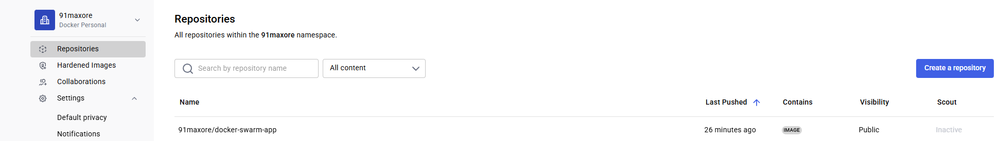

## Följ stegen nedan för att skapa ett **Docker Hub-repository**

**Steg 1: Logga in på Docker Hub:**

Gå till [https://hub.docker.com/repositories/ditt-användarnamn](https://hub.docker.com/repositories/ditt-användarnamn)

**Steg 2: Navigera till dina repositories:**

Du kommer direkt till listan över repositories under ditt konto. 

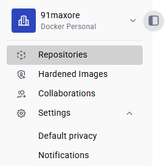

**Steg 3: Skapa ett nytt repository:**

Klicka på **"Create a Repository"** längst bort till höger.

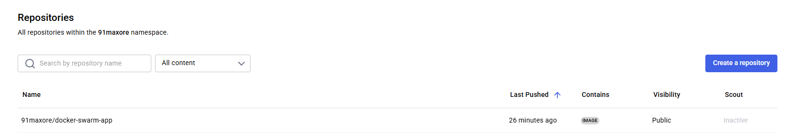

**Steg 4: Fyll i repository-information:**

- **Repository Name:** Ange ett namn för ditt repo, t.ex. `docker-swarm-app` kommer bli **ditt-användarnamn**/`docker-swarm-app` senare när du ska bygga och pusha Docker-image  
- **Visibility:** Välj om ditt repo ska vara **Public** eller **Private**  
- **Description:** Lägg till en kort beskrivning om av vad repot innehåller  
- Klicka på **"Create"**

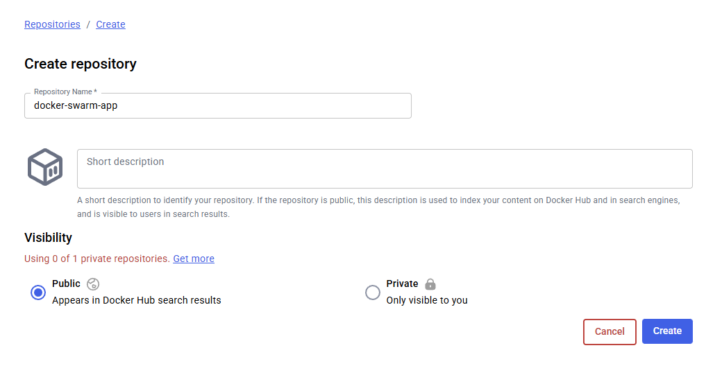

# Skapandet av Dockerfile

Jag skapade därefter en Dockerfile som använder PHP 8.2 med Apache och kopierar in mina applikationsfiler från projektmappen.
**Kortfattat:** en Dockerfile är en fil som beskriver hur ens Docker-image ska byggas.

**Dockerfile** (docker-swarm-app/Dockerfile) gör följande:

1. Använder officiell PHP 8.2 med Apache som grundimage.
2. Aktiverar Apache-modulen `mod_rewrite` för att möjliggöra URL-omskrivningar.
3. Kopierar alla applikationsfiler från projektmappen till Apache:s webbroot (`/var/www/html/`).
4. Exponerar port 80 så att webbservern kan ta emot HTTP-trafik.

# Byggandet av Docker Image och uppladdning till Docker Hub

### Nu är det dags att gå igenom stegen för att paketera projektet i en Docker-image och publicera den på Docker Hub

**Steg 1: Byggandet av Docker Image**

Jag använde terminalen i Visual Studio Code och angav följande kommando utifrån projektmappen (där appens samtliga filer finns) för att bygga mina applikations-filer till en Docker-image och ge den en tagg.  

**91maxore** = användarnamn  
**docker-swarm-app** = repo på Docker Hub

```bash
docker build -t 91maxore/docker-swarm-app:latest .
```

**Steg 2: Logga in på Docker Hub**

Logga in på Docker Hub via terminalen:
```bash
docker login
```

- Angav mitt användarnamn och lösenord som jag använder till Docker Hub.

**Steg 3: Pusha Docker-image till Docker Hub**

När imagen är byggd och du är inloggad, pusha imagen till Docker Hub med:
```bash
docker push 91maxore/docker-swarm-app:latest
```

Detta pushar min nyskapade Docker-image till Docker Hub och är redo för användning.  
Nu ligger den på Docker Hub:

🔗 https://hub.docker.com/repository/docker/91maxore/docker-swarm-app

När man skapar eller uppdaterar en Docker Swarm-service skickar manager-noden instruktionen till alla workers.
Om ens worker inte har den image-version som behövs, hämtar den automatiskt (pull) imagen från Docker Hub eller den angivna registry.
Man behöver alltså inte göra pull manuellt på varje worker.

# Initiering av Docker Swarm

För att initiera ett Docker Swarm-kluster, anslut till din swarm-manager via SSH och kör kommandot nedan som startar klustret och utser noden till manager.

**Steg 1: Börja med att SSHa in på vår nyskapade EC2 genom att ange:**
```bash
ssh -i ~Downloads/swarm-manager-key.pem ec2-user@34.246.185.128
```
**Notera att du får ändra sökvägen till din SSH-nyckel, samt den publika IP-adress till din EC2-instans**


**Steg 2: Initiera Docker Swarm-kluster på manager genom att köra följande:**

```bash
docker swarm init --advertise-addr 34.246.185.128
```

**Notera att du får byta ut IP-adressen mot den publika IP som din swarm-manager har***
- Kopiera nu kommandot med dess token som skrivs ut för att ansluta våra övriga worker-noder, du bör få något som ser ut så här:

```bash
docker swarm join --token SWMTKN-1-1qb2x87bw5wx75p5opwk8qqqoy513l2piskjrcze19acy8da3c-ec79bgjfs3q8doy3cpw3306js 172.31.23.10:2377
```

# Anslutning av worker-noder via SSH på Swarm Worker 1 och Swarm Worker 2

**Steg 1: Kör nu följande för att ansluta swarm-worker-1 och swarm-worker-2 till Docker Swarm-klustret:**

```bash
docker swarm join --token SWMTKN-1-1qb2x87bw5wx75p5opwk8qqqoy513l2piskjrcze19acy8da3c-ec79bgjfs3q8doy3cpw3306js 172.31.23.10:2377
```

- Notera att du får byta ut den token du får

**Steg 2: Verifera sedan på swarm-manager att worker-noderna har lagts till i klustret genom att ange:**

```bash
docker node ls
```

**Steg 3: Du bör då se något liknande:**

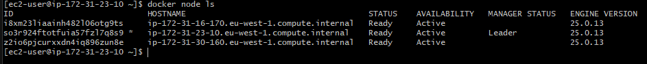

- Detta bekräftar att vårt Docker Swarm-kluster är nu skapad med 1 manager och 2 workers.

**Steg 4: Skapa Docker Compose-fil**

- En **docker-stack.yml** behövs för att definiera hela applikationens tjänster, nätverk och inställningar på ett och samma ställe, så att Docker Swarm kan deploya och hantera allt som en komplett stack.
- På swarm-manager, skapa stackfilen **docker-stack.yml** och klistra in följande:

```bash
version: "3.8"
services:
  web:
    image: 91maxore/docker-swarm-app:latest
    deploy:
      replicas: 3
      restart_policy:
        condition: on-failure
      update_config:
        parallelism: 1
        delay: 5s
    ports:
      - "80:80"
    networks: [webnet]

networks:
  webnet:
    driver: overlay
```

**Beskrivning**

* Kör `91maxore/docker-swarm-app` som en Swarm-tjänst med 3 repliker.
* Startar om repliker automatiskt vid fel.
* Exponerar tjänsten på port 80.
* Använder overlay-nätverk (`webnet`) så att tjänsten kan kommunicera med andra tjänster i klustret.

**Steg 5: Distribuera Docker Swarm-stacken genom att ange följande:**

```bash
sudo docker stack deploy -c docker-stack.yml docker-swarm-app
```

- docker-swarm-app blir namnet på stacken eftersom vår stack kommer i slutändan innehålla flera tjänster: web, viz och traefik
- samtliga tjänster kommer befinnas sig på följande benämningar: docker-swarm-app_web, docker-swarm-app_viz och docker-swarm-app_traefik

**Steg 6: Vi kan nu kontrollera statusen för varje instans av webbapplikationen, se på vilken nod de körs och verifiera att alla tre repliker fungerar som de ska. Detta görs med följande kommando:**

```bash
sudo docker service ps docker-swarm-app_web
```

- Webbapplikationen kör nu stabilt och som förväntat på alla tre noder i Swarm-klustret, vilket bekräftar att deploymenten fungerar korrekt.
- Kort sagt: bilden visar var och hur min web-app körs inom Swarm-klustret
- Det fungerar på samma sätt genom att senare ange docker-swarm-app_viz för Docker Vizualizer och docker-swarm-app_traefik för Traefik som hanterar reverse proxy + https

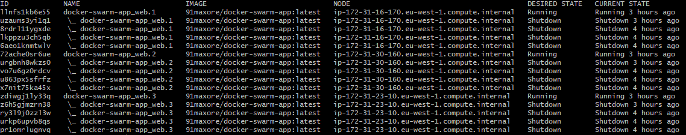

**Steg 7: Vi kan även verifiera att swarm-worker 1 och swarm-worker 2 tagit del av samma docker-image och att webbapplikationen är replikerad utöver alla 3 noder med följande kommando:**

```bash
docker service ls
```

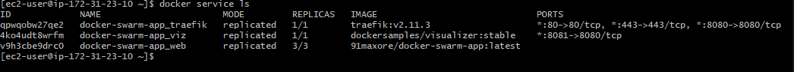

- Som du kan se kör mitt Docker Swarm-kluster även Traefik för reverse proxy och HTTPS-hantering, och detta kommer jag att gå igenom detta mer detaljerat senare i guiden.
- Dessutom kör mitt Docker Swarm-kluster även Docker Visualizer för att enkelt kunna se noder, tjänster och containrar i realtid, och detta kommer jag att gå igenom mer detaljerat i nästa steg.

# Docker Vizualiser
Docker Swarm Visualizer är ett verktyg som ger en grafisk översikt över ditt Docker Swarm-kluster.
Det visar alla noder, både manager och worker, samt vilka containrar som körs på respektive nod i realtid.
Vizualizer är ett utmärkt sätt att snabbt förstå klustrets struktur, övervaka distributionen av tjänster och kontrollera att skalning och repliker fungerar som förväntat.

**Steg 1: Börja med att addera följande till docker-stack.yml som vi skapade tidigare för att lägga till Viazualiser som tjänst till vår stack:**

- Eftersom Docker Vizualiser är en tjänst listar vi även den under **services** som nedan.

```bash

services:
  viz:
    image: dockersamples/visualizer:stable
    deploy:
      placement:
        constraints:
          - node.role == manager
    ports:
      - "8081:8080"                   # Visualizer-webbgränssnitt
    volumes:
      - /var/run/docker.sock:/var/run/docker.sock
    networks:
      - webnet

networks:
  webnet:
    driver: overlay
```

**Beskrivning**
- Kör Visualizer som en Swarm-tjänst på manager-noden.
- Mountar Docker-socket för att kunna läsa klustrets noder och containrar.
- Exponerar Visualizer på port 8081
- Använder overlay-nätverk så den kan kommunicera med andra tjänster om det behövs.

**Steg 2: Deploya återigen stacken genom att köra detta på manager-noden:**

```bash
docker stack deploy -c docker-stack.yml docker-swarm-app
```

**Steg 3: Kontrollera att tjänsten körs**

```bash
docker service ps docker-swarm-app_viz
```

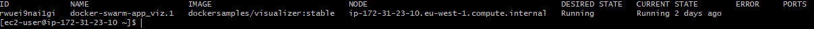

**Steg 4: Öppna Visualizer**

- Surfa in till managers publika IP följt av port 8081, alltså i mitt fall: http://34.246.185.128:8081
- Du ser alla noder och containrar i ditt Swarm-kluster visuellt.

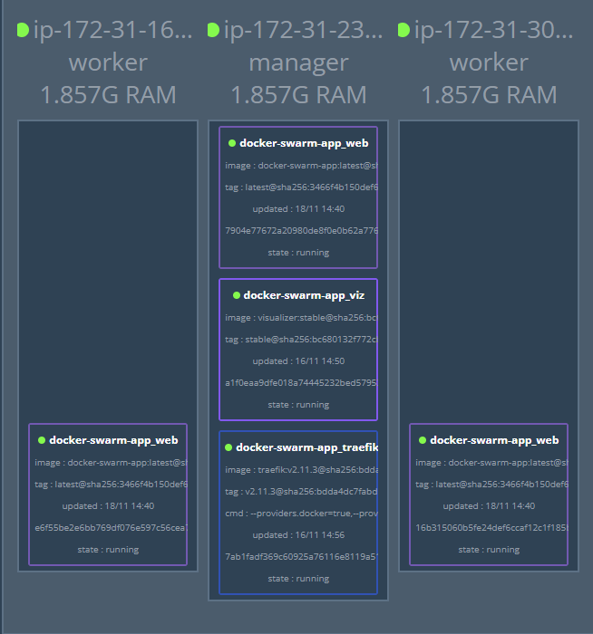

**Sammanfattningsvis:**
- Visualizer körs som en separat service på manager, exponerar ett webbläsargränssnitt och visar i realtid alla noder och containrar i Swarm-klustret.

# Traefik

Traefik är en dynamisk reverse proxy och lastbalanserare designad för Docker Swarm.

I min miljö körs Traefik på managern, där den automatiskt upptäcker alla tjänster och repliker som körs ute på klustrets noder. Detta gör att min applikation, oavsett om dess containrar körs på manager-noden eller på dina två workers, alltid nås via en central och smart styrd ingångspunkt.

Ett av huvudskälen att använda Traefik i min kluster är dess **automatiserade hantering av HTTPS via Let’s Encrypt**. Med ACME-integration bygger Traefik själv ut, förnyar och lagrar certifikat utan att du behöver göra något manuellt — vilket ger en trygg och självgenererande säkerhetslösning på både port 80 och 443.

Utöver detta fungerar Traefik som en **dynamisk reverse proxy**, där routning uppdateras i realtid när tjänster skalas upp eller ned. All trafik lastbalanseras automatiskt över dina tre repliker av `web`-tjänsten och fördelas jämnt oavsett vilken nod de körs på.

Med Traefiks dashboard, som du exponerar på port 8080, får du dessutom en tydlig visuell överblick över routers, tjänster, certifikat och trafikflöden i realtid — perfekt för att verifiera att lastbalansering, HTTPS och routning fungerar som tänkt.

**Traefik är därför en komplett och självgående lösning för att hantera reverse proxy, trafikstyrning och automatiska HTTPS-certifikat i ditt Docker Swarm-kluster.**

**Steg 1: Börja med att återigen addera följande till docker-stack.yml som vi skapade tidigare för att lägga till Traefik som tjänst till vår stack:**

- Eftersom Traefik är en tjänst listar vi även den under **services** som nedan.

```bash

services:
  traefik:
    image: traefik:v2.11.3
    command:
      - "--providers.docker=true"
      - "--providers.docker.swarmMode=true"
      - "--providers.docker.exposedbydefault=false"
      - "--entrypoints.web.address=:80"
      - "--entrypoints.websecure.address=:443"
      - "--entrypoints.web.http.redirections.entrypoint.to=websecure"
      - "--entrypoints.web.http.redirections.entrypoint.scheme=https"
      - "--certificatesresolvers.myresolver.acme.httpchallenge=true"
      - "--certificatesresolvers.myresolver.acme.httpchallenge.entrypoint=web"
      - "--certificatesresolvers.myresolver.acme.email=91maxore@gafe.molndal.se"
      - "--certificatesresolvers.myresolver.acme.storage=/letsencrypt/acme.json"
      - "--api.insecure=true"
      - "--log.level=DEBUG"
    ports:
      - "80:80"
      - "443:443"
      - "8080:8080"
    volumes:
      - /var/run/docker.sock:/var/run/docker.sock:ro
      - traefik_letsencrypt:/letsencrypt
    deploy:
      placement:
        constraints:
          - node.role == manager
      restart_policy:
        condition: on-failure
    networks:
      - webnet

networks:
  webnet:
    driver: overlay

volumes:
  traefik_letsencrypt:
```

## **Beskrivning (Traefik)**

* Kör Traefik som en Swarm-tjänst placerad på manager-noden.
* Använder Docker-socket för att automatiskt upptäcka tjänster och repliker i Swarm-klustret.
* Fungerar som en reverse proxy och lastbalanserare för alla tjänster som har Traefik-labels.
* Hanterar HTTPS automatiskt med Let’s Encrypt via ACME.
* Exponerar HTTP (80), HTTPS (443) och Traefik Dashboard (8080) på manager-noden.
* Dirigerar all trafik från HTTP → HTTPS med automatisk omdirigering.
* Lagrar certifikat i en persistent volym för att undvika att certifikat återskapas vid omstart.
* Körs i overlay-nätverk (`webnet`) för att kunna nå alla tjänster i Swarm-klustret.

**Steg 2: Deploya återigen stacken genom att köra detta på manager-noden:**

```bash
docker stack deploy -c docker-stack.yml docker-swarm-app
```

**Nu när vi konfiguerat alla tre tjänster inom stacken så kommer stacken starta:**
- Traefik på managern
- Din app med 3 repliker fördelade över noderna
- Visualizer på managern

**Steg 3: Kontrollera att tjänsten körs**

```bash
docker service ps docker-swarm-app_traefik
```

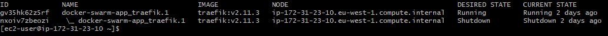

**Steg 4: Kontrollera att samtliga tjänster körs**

```bash
docker service ls
```

- Detta borde visa att samtliga tjänster inom stacken vi konfiguerat körs och är replikerade.

* **Traefik**: Reverse proxy med HTTPS via Let’s Encrypt, dashboard på port 8080.
* **Web**: Applikation med flera repliker, lastbalanseras av Traefik.
* **Visualizer (viz)**: Visar klustrets noder och containrar i realtid på port 8081.

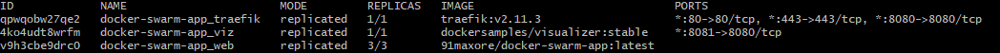

**Steg 4: Öppna Traefiks Dashboard**

- Surfa in till managers publika IP följt av port 8080, alltså i mitt fall: http://34.246.185.128:8080
- Du ser nu alla routers, tjänster och trafikflöden i ditt Swarm-kluster visuellt via Traefiks dashboard.
- Notera att jag konfiguerat wavvy.se domänen via Loopia så den konfigurationen är inte inkluderad i denna guide.

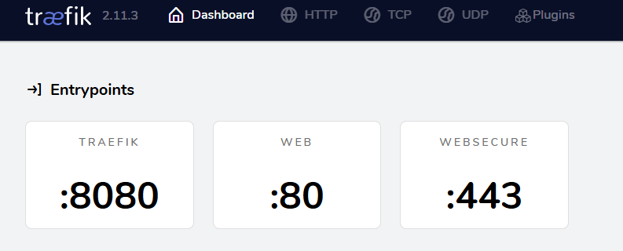

**Steg 5: För att HTTPS ska fungera korrekt behöver vi konfigurera Traefik-labels på web-tjänsten så att den kan routa trafiken min domän.**

```bash
web:
  image: 91maxore/docker-swarm-app:latest
  deploy:
    replicas: 3
    restart_policy:
      condition: on-failure
    labels:
      - "traefik.enable=true"
      - "traefik.http.routers.web.rule=Host(`wavvy.se`)"
      - "traefik.http.routers.web.entrypoints=websecure"
      - "traefik.http.routers.web.tls=true"
      - "traefik.http.routers.web.tls.certresolver=myresolver"
      - "traefik.http.services.web.loadbalancer.server.port=80"
  networks:
    - webnet
  ```

- Ersätt därmed denna med den tidigare web-del i stack-filen vi använde oss av.
- Dessa labels gör att Traefik vet vilken domän trafiken ska routas till, vilka entrypoints som ska användas, att TLS ska aktiveras, och vilken certifikatlösare som ska hantera Let’s Encrypt-certifikaten.
- Traefik-labels konfigurerar web-tjänsten så att HTTPS fungerar och all HTTP-trafik automatiskt dirigeras till HTTPS.
- Ersätt även med din domän (wavvy.se)


**Steg 6: Verifiera HTTPS**

- Surfa nu in till https://wavvy.se
- Vi kan därmed granska att appen fungerar som den ska med HTTPS/SSL. Du kan även se på bilden att **anslutningen är säker** och att **certifikatet är giltigt**

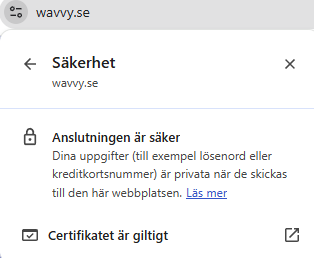

**Traefik:**
- Tar emot trafiken
- Skapar certifikat automatiskt via Let's Encrypt
- Lastbalanserar över dina 3 web-repliker
- Dirigerar all HTTP → HTTPS

**Sammanfattningsvis:**

* Traefik körs som en separat service på manager, exponerar ett webbläsargränssnitt och visar i realtid alla routers, tjänster och trafikflöden i Swarm-klustret.

**Beskrivning av de tre tjänsterna** i min stack:

* **docker-swarm-app_web** (Web-applikation)
  Webbapplikationen hanterar allt innehåll, som HTML och PHP, och körs som flera repliker som fördelas mellan manager och worker-noder i Swarm-klustret.
Det gör att applikationen kan skalas och distribueras över flera noder, vilket ger hög tillgänglighet och jämn belastning utan att påverka användarupplevelsen.

* **docker-swarm_viz (Docker Swarm Visualizer)**
  Visualizer är ett grafiskt verktyg som visar Swarm-klustret i realtid, inklusive manager- och worker-noder samt alla containrar.
Det gör det enkelt att övervaka hur tjänster och repliker distribueras över klustret, vilket ger snabb insikt i klustrets status och hjälper till att upptäcka problem med belastning eller distribution.

* **docker-swarm_traefik (Traefik)**
  Traefik är en reverse proxy och lastbalanserare som körs i Swarm på manager-noden och som hanterar inkommande trafik.
Den hanterar automatiskt routing av trafik till dina tjänster, distribuerar trafiken till din web-applikation, skapar och förnyar HTTPS-certifikat via Let’s Encrypt, och ger en visuell översikt över routers, tjänster och trafikflöden via dashboarden.

# Automatiserad deployment med GitHub Actions (CI/CD)

**Steg 1: Skapa ett GitHub-repo**
- Bege dig över till ditt GitHub-konto
- Skapa ett nytt repo på GitHub genom att Klicka på New repository
- Jag döpte min till **docker-swarm-app2** enbart för att demonstrera
- Välj Public eller Private beroende på behov. 
- Klicka på Create repository.

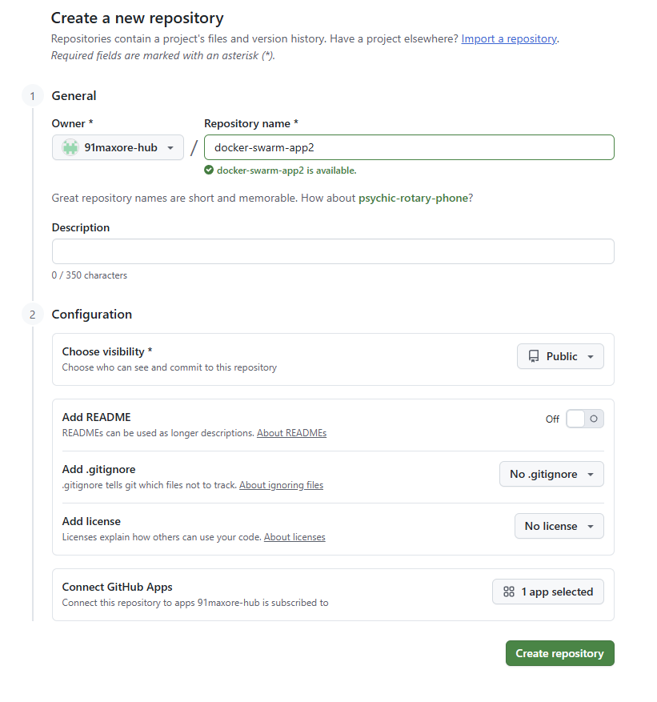

Efter att du skapat ditt repo kommer du bli hänvisad till följande instruktioner som du kan se nedan på bilden. Kopiera **Quick setup**-länken och följ vidare instruktionerna på mitt nästa steg. 

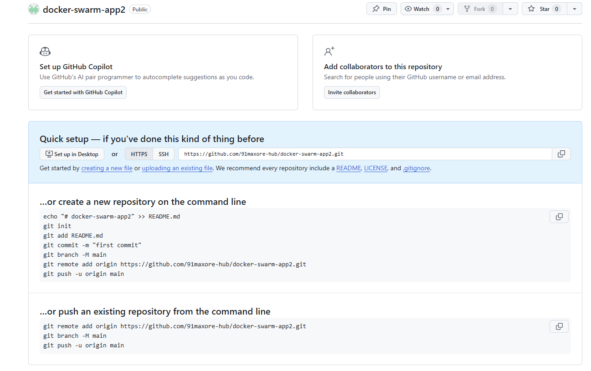

**Steg 2: Bege dig till projektmappen**  
Öppna terminalen och bege dig till projektmappen där appens filer ligger på din lokala dator ex.

```bash
cd ~/docker-swarm-app
```

**Steg 3: Initiera ett nytt Git-repo**

```bash
git init
```

**Steg 4: Lägg till README.md**

```bash
git add README.md
```

**Steg 5: Commit:a ändringarna:**

```bash
git commit -m "CI/CD Pipeline"
```

**Steg 6: Anslut lokalt repo till GitHub:**

```bash
git remote add origin git@github.com:91maxore-hub/docker-swarm-app.git
```

- Ersätt med quick-setup länken vi kopierade tidigare.

**Steg 7: Pusha till GitHub**

```bash
git push -u origin main
```

**Steg 8: Sen varje gång du gör ändringar i en eller flera filer kan du enkelt ange följande kommando för att pusha samtliga ändringar i filer till GitHub:**

```bash
git add . && git commit -m "CI/CD Pipeline" && git push origin main
```

- Detta kommer endast pusha ändrade filer till GitHub och därifrån utgöra en CI/CD-automatiserings deployment så att Docker-imagen alltid håller sig uppdaterad, och därav samma med container-hosten som hostar appen.

Jag har nu initierat GitHub-repot och det är redo att användas för CI/CD-deployments.

**Steg 9. Skapa GitHub Actions workflow**  
Nästa steg är att skapa en **deploy.yml** för upprätthålla en CI/CD.  
Så skapa mappen och workflow-filen enligt strukturen som nedan:

```bash
mkdir -p .github/workflows
```

**Workflow-filen** (.github/workflows/deploy.yml) gör följande:

1. Checkoutar koden från GitHub-repot.
2. Sätter upp Docker Buildx för multi-platform builds.
3. Loggar in på Docker Hub med GitHub Secrets.
4. Bygger Docker-imagen för applikationen.
5. Pushar imagen till Docker Hub.
6. Ansluter till Swarm-manager via SSH med GitHub Secrets.
7. Deployar stacken på Docker Swarm med `docker stack deploy -c docker-stack.yml`, uppdaterar tjänster och rullar ut den nya imagen automatiskt.

```bash
name: CI/CD Pipeline

on:
  push:
    branches:
      - main

jobs:
  build-and-deploy:
    runs-on: ubuntu-latest

    steps:
    - name: Checkout code
      uses: actions/checkout@v3

    - name: Set up Docker Buildx
      uses: docker/setup-buildx-action@v2

    - name: Log in to DockerHub
      uses: docker/login-action@v2
      with:
        username: ${{ secrets.DOCKER_USERNAME }}
        password: ${{ secrets.DOCKER_PASSWORD }}

    - name: Build and push Docker image
      run: |
        docker build -t 91maxore/docker-swarm-app:latest .
        docker push 91maxore/docker-swarm-app:latest

    - name: Deploy to Swarm
      uses: appleboy/ssh-action@v0.1.7
      with:
        host: ${{ secrets.SSH_HOST }}
        username: ${{ secrets.SSH_USER }}
        key: ${{ secrets.SSH_PRIVATE_KEY }}
        script: |
          docker stack deploy -c /home/ec2-user/docker-stack.yml docker-swarm-app
```

Innan vi dock kan gå vidare med att deploya deploy.yml filen behöver vi sätta upp lite GitHub Secrets.

# GitHub Secrets-konfigurationer

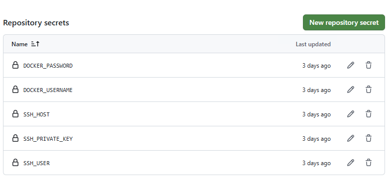

# GitHub Secrets-tabell

| **Secret**        | **Beskrivning**                                                                         |
| ----------------- | --------------------------------------------------------------------------------------- |
| `DOCKER_USERNAME` | Mitt användarnamn på Docker Hub, används för att logga in och pusha images - `91maxore` |
| `DOCKER_PASSWORD` | Mitt lösenord för Docker Hub                                                            |
| `SSH_HOST`        | IP-adress till Swarm-manager där stacken deployas - `34.246.185.128`                    |
| `SSH_USER`        | Användarnamnet som används för SSH-anslutningen till manager-noden - `ec2-user`         |
| `SSH_PRIVATE_KEY` | Privat SSH-nyckel som matchar en publik nyckel på Swarm-manager för autentisering       |

# Så här lägger du till en GitHub Secret

1. Öppna ditt repo på GitHub (ex. https://github.com/91maxore-hub/docker-swarm-app)
2. Navigera till fliken **Settings**
3. Navigera till **Secrets and variables → Actions**
4. Klicka på **"New repository secret"**
5. Fyll i:
    - **Name** – t.ex. `SSH_HOST`
    - **Secret** – `34.246.185.128`
6. Spara med **"Add secret"**

Enligt bästa praxis ska inga känsliga värden, såsom IP-adresser, domännamn, SSH-nycklar eller e-postadresser etc. hårdkodas i koden. Istället lagras desssa uppgifter säkert som GitHub Secrets i repot för att skydda dem från obehörig åtkomst och för att underlätta säker hantering.

**Steg 10: Lägg till workflow och pusha**  
För att kontrollera att workflow-filen och CI/CD-deploymen­t fungerar korrekt, pusha ändringarna i ett steg:
```bash
git add .github/workflows/deploy.yml && git commit -m "Lägg till GitHub Actions workflow för CI/CD" && git push origin main
```

**Steg 11: Verifiering av CI/CD funktionalitet**  
Gå till ditt GitHub-repo, till exempel:  
**https://github.com/91maxore-hub/docker-swarm-app** och granska resultatet.

Navigera sedan till fliken **Actions**.

Om CI/CD är korrekt konfigurerat bör du se att de senaste körningarna är markerade med en **grön bock** som nedan:

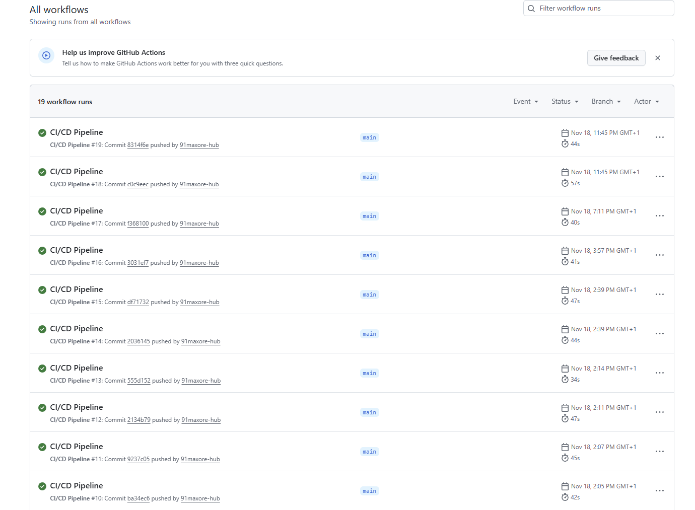

Dessutom en **status** som visar **Success**.  Exempel på ett lyckat arbetsflöde:

**build-and-push — Success**

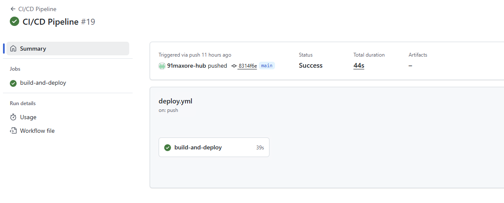

# ✅ Resultat

Efter att allt var uppsatt och CI/CD-deployment gick igenom kunde jag gå till:
🔗 https://wavvy.se

Min PHP-app laddas med giltigt SSL-certifikat, automatisk HTTPS och reverse proxy som hanterar trafiken smidigt genom Traefik.
Allt detta sker helt automatiskt – både deployment och certifikatförnyelse.


<h1 align="center">Serverless App</h1>

<p align="center" style="font-size: 20px; color: black;">
  <strong>GitHub Repo:</strong>
  <a href="https://github.com/91maxore-hub/serverless-app" style="color: black; font-weight: bold;">
    https://github.com/91maxore-hub/serverless-app
  </a>
  <br><br>
  <a href="d3vjy5bvefx3w.cloudfront.net" style="color: black; font-weight: bold;">
    d3vjy5bvefx3w.cloudfront.net
  </a>
</p>


I detta projekt har jag byggt en skalbar och kostnadseffektiv serverless-miljö för en webbapplikation på AWS. Applikationen använder **AWS S3** för hosting av statiska filer, **AWS Lambda** för backend-logik, **API Gateway** för att hantera HTTP-förfrågningar och **DynamoDB** för lagring av formulärsvar. För att säkerställa snabb och säker åtkomst till applikationen används **CloudFront** som reverse proxy med stöd för HTTPS.

Applikationen är helt serverlös, vilket innebär att infrastrukturen automatiskt skalar baserat på belastning, utan behov av att hantera servrar eller operativsystem. Detta gör lösningen både flexibel och lättunderhållen, samtidigt som den erbjuder hög tillgänglighet och prestanda.

För att underlätta utveckling och deployment har jag implementerat **CI/CD med AWS CodePipeline kopplat till GitHub**, vilket automatiskt bygger och distribuerar nya versioner av applikationen till S3 och Lambda. Detta säkerställer snabb iteration och pålitlig uppdatering av applikationen utan manuella steg.

Denna lösning visar hur serverless-teknologi kan kombineras med molntjänster för att skapa en modern webbmiljö som är skalbar, säker och kostnadseffektiv.

Noterbart är att i detta projekt har jag utnyttjat följande molntjänster från AWS:

* **S3 (Simple Storage Service):** Hosting av statiska filer som HTML, CSS och JavaScript.
* **Lambda:** Serverlös körning av backend-logik för formulärhantering och affärslogik.
* **API Gateway:** Hantering av HTTP-förfrågningar och routing till Lambda-funktioner.
* **DynamoDB:** Lagring av formulärsvar och annan applikationsdata.
* **CloudFront:** Content delivery och reverse proxy med HTTPS för säker och snabb åtkomst.
* **CodePipeline + GitHub:** CI/CD som möjliggör automatiska bygg och deployment av applikationen.

| Komponent                 | Beskrivning                                                      | Användningsområde                          | Kommentar                                                          |
| ------------------------- | ---------------------------------------------------------------- | ------------------------------------------ | ------------------------------------------------------------------ |
| **S3**                    | Lagrar och serverar statiska filer som HTML och CSS              | Hosting av frontend                        | Ger hög tillgänglighet och enkel skalning utan serverhantering     |
| **Lambda**                | Serverlösa funktioner som kör backend                            | Hantering av formulärdata                  | Skalar automatiskt baserat på belastning, inga servrar att hantera |
| **API Gateway**           | Hanterar HTTP-förfrågningar och routear dem till Lambda          | Exponering av backendfunktioner som API    | Säkerställer HTTP API-kommunikation mellan frontend och Lambda     |
| **DynamoDB**              | Databas för lagring av formulärsvar                              | Databas för applikationen                  | Fullt hanterad, serverlös, mycket låg latency                      |
| **CloudFront**            | Reverse Proxy med HTTPS                                          | Snabb och säker åtkomst till applikationen | Minskar latens globalt och ger HTTPS-stöd                          |
| **CodePipeline + GitHub** | CI/CD-pipeline som bygger och deployar applikationen automatiskt | Automatiserad deployment                   | Säkerställer snabb iteration och pålitlig uppdatering              |

# Mappstruktur

| Katalog / Fil             | Typ            | Beskrivning                                                                             |
| ------------------------- | -------------- | --------------------------------------------------------------------------------------- |
| **index.html**            | HTML-fil       | Huvudsida för webbapplikationen                                                         |
| **contact_form.html**     | HTML-fil       | Sida med kontaktformulär för användare                                                  |
| **thankyou.html**         | HTML-fil       | Sida som visas efter att formuläret skickats                                            |
| **style.css**             | CSS-fil        | Stilark som styr utseende och layout för webbapplikationen                              |
| **contactFormHandler.js** | JavaScript-fil | Backend-funktion (AWS Lambda) som hanterar formulärinlämning och sparar data i DynamoDB |

# Konfiguration av Amazon S3-bucket

Denna guide beskriver hur man skapar och konfigurerar en Amazon S3-bucket för att hosta statiska webbapplikationsfiler. Målet är att tillhandahålla en högpresterande och skalbar hostingmiljö för HTML-, CSS- och övriga statiska resurser. Bucketen kommer att konfigureras med offentlig läsbehörighet för hosting, samt integreras med CloudFront för snabb distribution och HTTPS-stöd.

**Steg 1: Bege dig till aws.amazon.com**


**Steg 2: Ange S3 i sökrutan och välj "S3 - Scaleable Storage in the Cloud"**

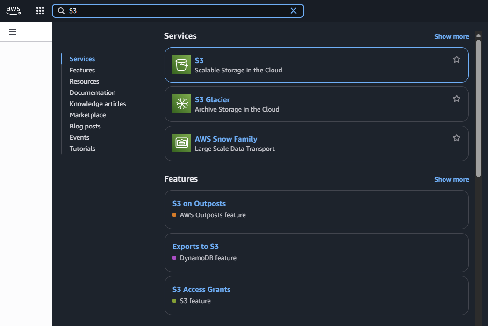

**Steg 3: Välj Create bucket**

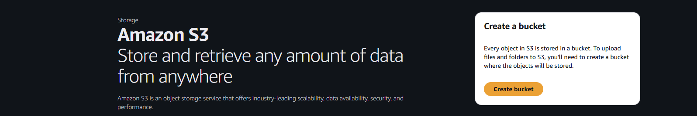

**Steg 4: Ange ett namn för vår S3-bucket, jag kommer namnge den serverless-bucket-2025**

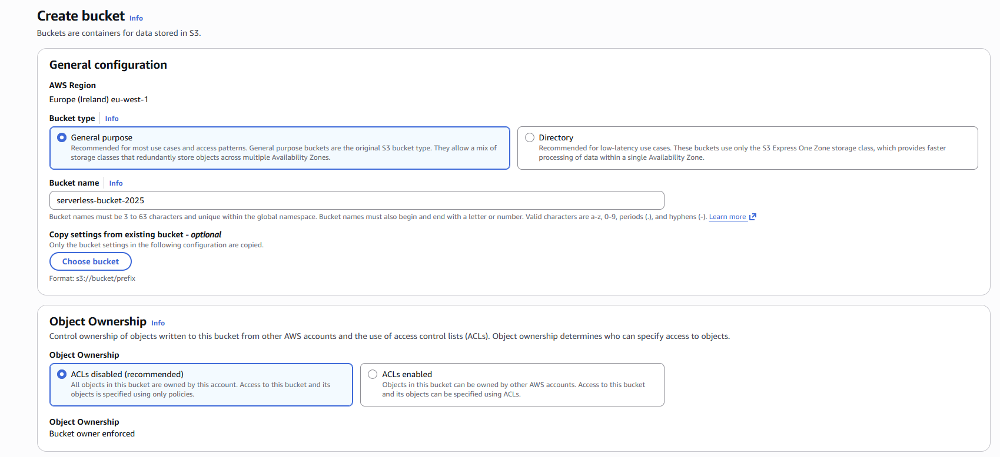

**Steg 5: Gå sedan lite längre ner och bocka ur "Block Public Access settings for this bucket" eftersom vi vill ju komma åt våra filer genom appen**

- Bucket Versioning kan aktiveras för att automatiskt behålla tidigare versioner av filer, vilket underlättar återställning vid oavsiktliga ändringar eller borttagningar. Men i detta fall skippar vi det.
- Resten kan lämnas som det är.

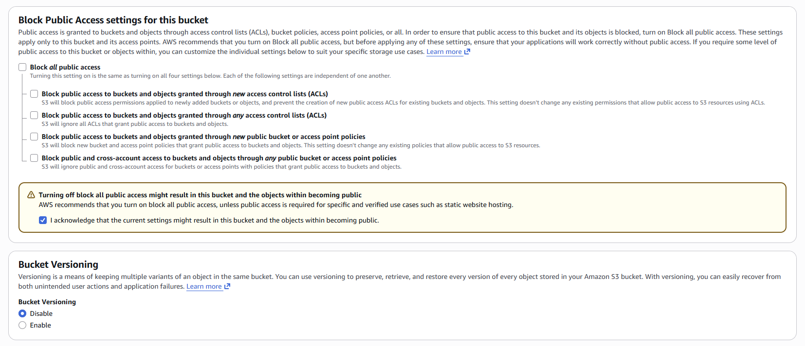

**Steg 6: Välj slutligen Create bucket**

**Steg 7: Du gör nu få en översikt över din nyskapade S3-bucket**

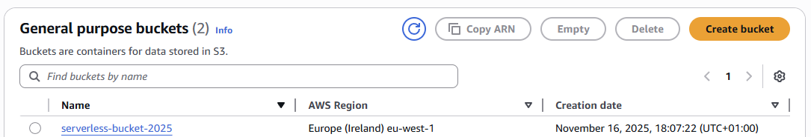

**Steg 8: Klicka på "Upload" längst bort till höger**


**Steg 9: Välj därefter att ladda upp mappar eller filer. I vårt ändamål kommer vi att ladda upp endast appens filer. Så vi väljer "Add files" följt av "Upload" längst ner**

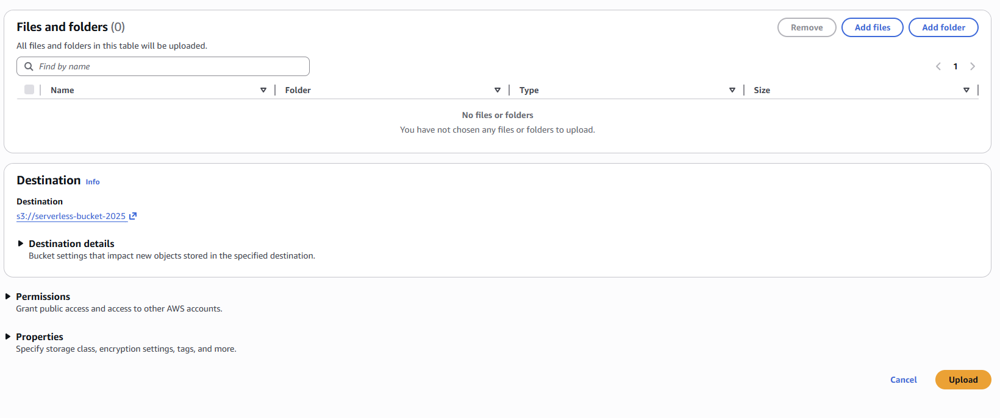

**Steg 10: Slutligen bör du se en översikt över filerna vi precis laddade upp.**

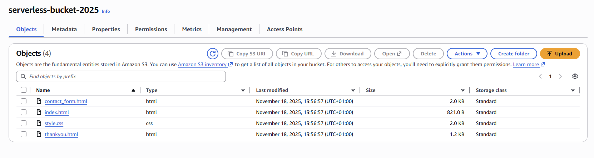

# Konfiguration av Amazon DynamoDB för lagring av formulärsvar

Denna guide beskriver hur man skapar och konfigurerar en Amazon DynamoDB-tabell för att lagra data från webbapplikationens kontaktformulär. Målet är att tillhandahålla en högpresterande, serverlös och skalbar databaslösning som kan hantera varierande trafik utan att behöva hantera servrar.

**Steg 1: Bege dig till aws.amazon.com**


**Steg 2: Ange DynamoDB i sökrutan och välj "DynamoDB - Managed NoSQL Database**

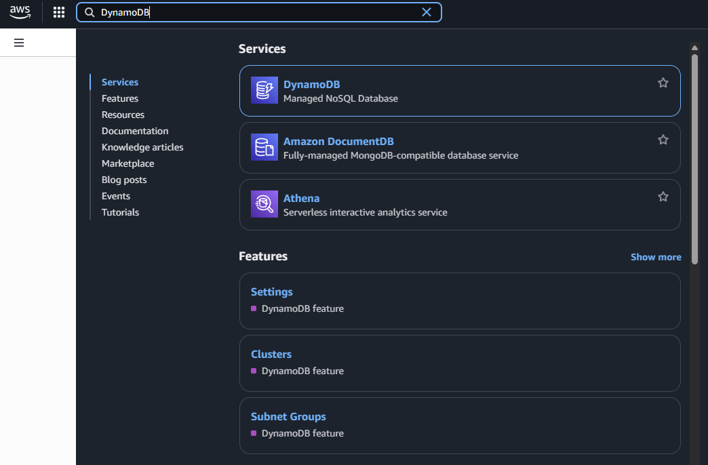

**Steg 3: Välj Create table**


**Steg 4: Ange ett namn för vår DynamoDB-databas, jag kommer namnge den ContactFormMessages**

- Ange även **id** som Partion key och värdet ska vara **String**

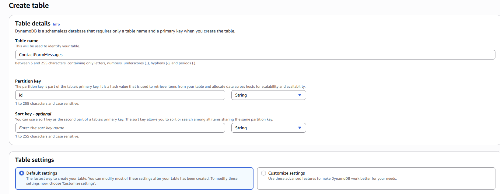

**Steg 5: Slutligen bör du se en översikt över databasen vi precis skapade**

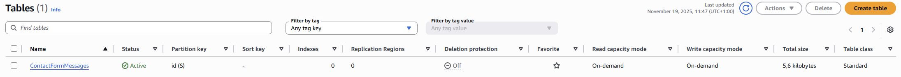

### Uppsättning av AWS Lambda

Denna guide beskriver hur man skapar och konfigurerar AWS Lambda-funktioner för att hantera backend-logik i webbapplikationen. Målet är att tillhandahålla en skalbar, serverlös miljö där funktioner automatiskt kan exekveras som svar på HTTP-förfrågningar via API Gateway.
Lambda-funktionerna kommer att hantera inlämning av formulärdata, validering av inkommande data och lagring i DynamoDB, utan att kräva några underhållskrav på servrar.

**Steg 1: Bege dig till aws.amazon.com**


**Steg 2: Ange Lambda i sökrutan och välj "Lambda - Run code without thinking about servers**

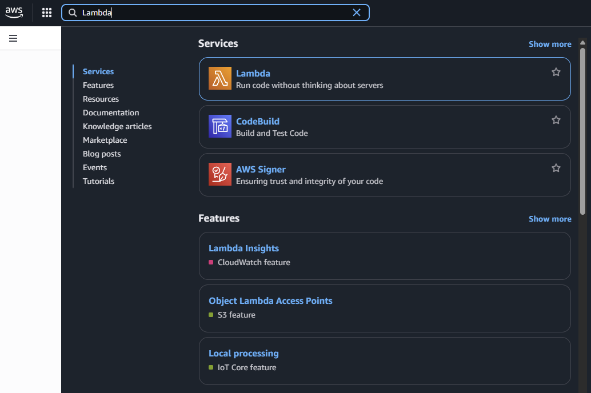

**Steg 3: Navigera till Functions**

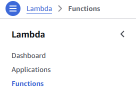

**Steg 4: Välj Create function längst till höger**

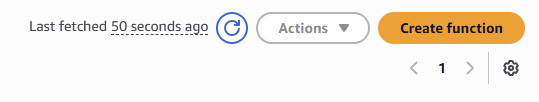

**Steg 5: Ange ett namn för vår Lambda-function, jag kommer namnge den contactFormHandler**

- Resten kan lämnas som det är

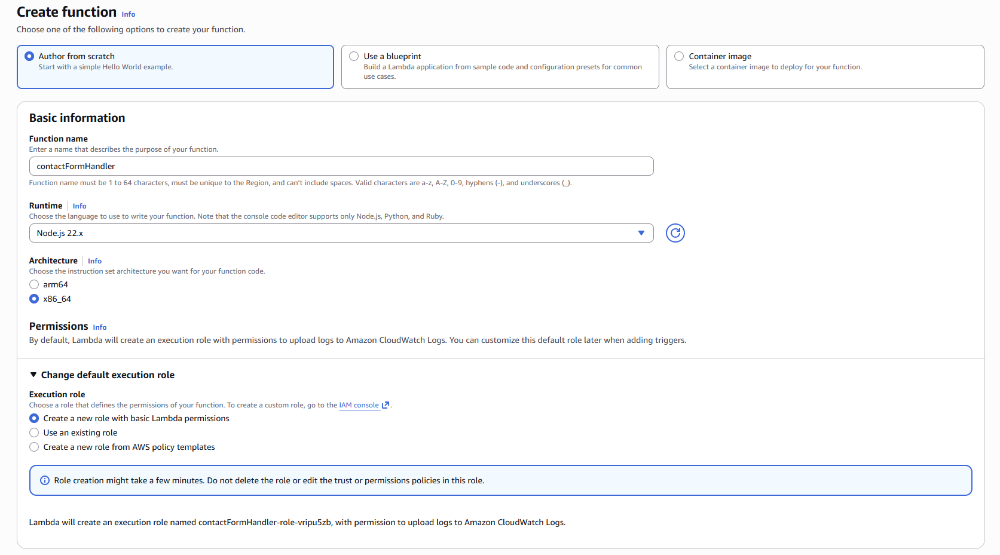

**Steg 6: Slutligen bör du se en översikt över funktionen (contactFormHandler.js) vi precis skapade**

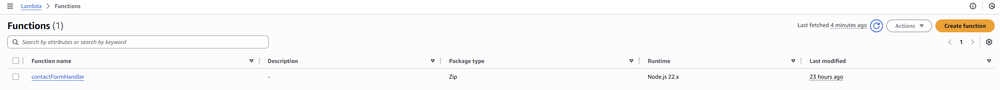

**Steg 7: Gå in på den och klistra in följande kod:**

```bash
const { DynamoDBClient, PutItemCommand } = require("@aws-sdk/client-dynamodb");
const crypto = require("crypto");

const db = new DynamoDBClient({ region: "eu-west-1" });

exports.handler = async (event) => {
  console.log("Incoming event:", JSON.stringify(event));

  if (event.httpMethod === "OPTIONS") {
    return {
      statusCode: 204,
      headers: {
        "Access-Control-Allow-Origin": "https://d3vjy5bvefx3w.cloudfront.net",
        "Access-Control-Allow-Methods": "POST,OPTIONS",
        "Access-Control-Allow-Headers": "Content-Type",
      },
      body: ""
    };
  }

  let data;
  try {
    data = JSON.parse(event.body || "{}");
  } catch (e) {
    console.error("JSON parse error:", e);
    return {
      statusCode: 400,
      headers: { "Access-Control-Allow-Origin": "https://d3vjy5bvefx3w.cloudfront.net" },
      body: JSON.stringify({ error: "Invalid JSON in request" })
    };
  }

  const id = crypto.randomUUID();

  const params = {
    TableName: "ContactFormMessages",
    Item: {
      id: { S: id },
      name: { S: data.name || "UNKNOWN" },
      email: { S: data.email || "UNKNOWN" },
      message: { S: data.message || "EMPTY" },
      createdAt: { S: new Date().toISOString() }
    }
  };

  try {
    console.log("Trying to write to Dynamo:", params);
    await db.send(new PutItemCommand(params));
    console.log("Write SUCCESS");

    return {
      statusCode: 200,
      headers: {
        "Access-Control-Allow-Origin": "https://d3vjy5bvefx3w.cloudfront.net",
        "Access-Control-Allow-Headers": "Content-Type",
        "Access-Control-Allow-Methods": "POST,OPTIONS",
      },
      body: JSON.stringify({
        success: true,
        id,
        ...data
      })
    };

  } catch (err) {
    console.error("DynamoDB ERROR:", err);

    return {
      statusCode: 500,
      headers: {
        "Access-Control-Allow-Origin": "https://d3vjy5bvefx3w.cloudfront.net"
      },
      body: JSON.stringify({ error: "Could not save message", details: err.message })
    };
  }
};
```
## **Beskrivning (Lambda – contactFormHandler.js)**

* Körs som en serverlös AWS Lambda-funktion som hanterar inkommande HTTP-förfrågningar via API Gateway.
* Tar emot formulärdata från frontend och validerar JSON-innehållet.
* Genererar ett unikt ID för varje formulärinlämning med `crypto.randomUUID()`.
* Sparar formulärdata (`name`, `email`, `message`, `createdAt`) i DynamoDB-tabellen `ContactFormMessages`.
* Hanterar CORS (Cross-Origin Resource Sharing) för att möjliggöra anrop från frontend-distributionen på CloudFront.

- Notera att jag har min CloudFront-URL för Access-Control-Allow-Origin, alltså den enda domänen som har tillåtelse att använda min Lambda-fuction. Jag kommer gå igenom hur man sätter upp API Gateway och CloudFront i nästkommande steg.
- Du kan för tillfället ange S3-Bucket URL för att testa dess funktionalitet men det fungerar på samma sätt eftersom du talar endast om för Lambda-funktionen vilken domän som är tillåten att använda den.

# Uppsättning av Amazon API Gateway för HTTP API

Denna guide beskriver hur man skapar och konfigurerar Amazon API Gateway som en HTTP API för att hantera kommunikationen mellan frontend och serverlösa Lambda-funktioner. Målet är att tillhandahålla en skalbar, säker och lättanvänd ingångspunkt för webbapplikationen, som möjliggör REST-liknande interaktioner utan att behöva hantera servrar. API Gateway kommer att routa inkommande HTTP-förfrågningar till Lambda-funktionerna, hantera CORS och säkerställa att data från formulär kan skickas och tas emot på ett pålitligt sätt.

**Steg 1: Bege dig till aws.amazon.com**


**Steg 2: Ange API Gateway i sökrutan och välj "API Gateway - Build, Deploy and Manage APIs**

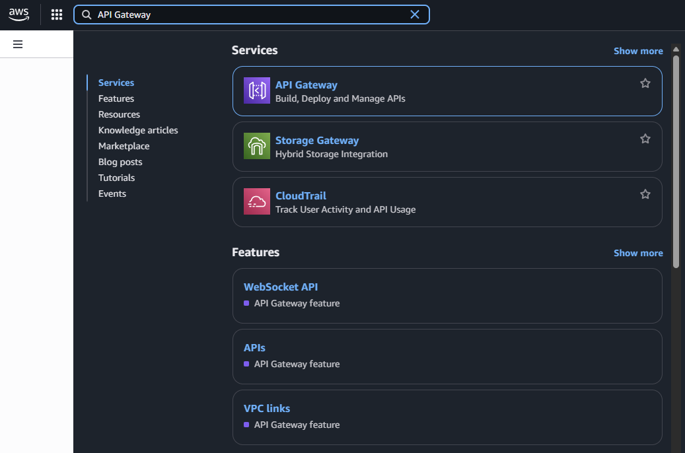

**Steg 3: Välj "Create an API" längst till höger**

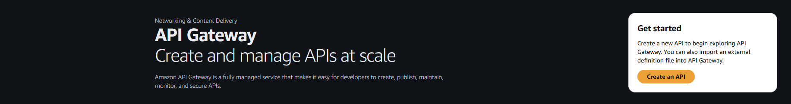

**Steg 4: Välj "HTTP API"**

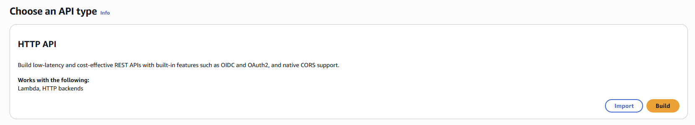

**Steg 5: Ange ett namn för vår API, jag kommer namnge den contactHandlerFormAPI**
**Välj även vår Lambda-function vi skapade under förgående steg under Integrations**

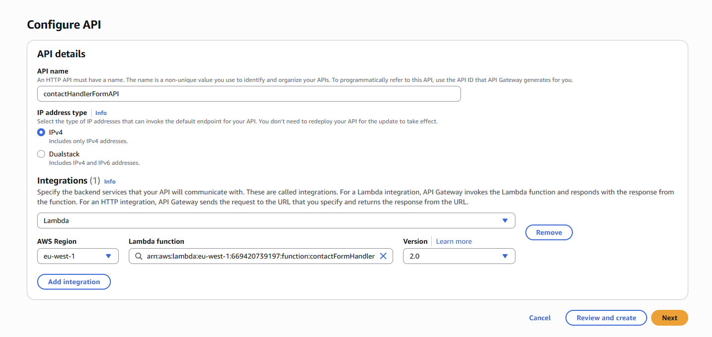

**Steg 6: Här behöver vi ange en route till vår API som ska nås via vår Lambda-fuction**

Fyll i:
    - **Method** – t.ex. `POST`
    - **Resource path** – `/contact`
    - **Integration target** - `contactFormHandler`
6. Spara med **"Add route"**

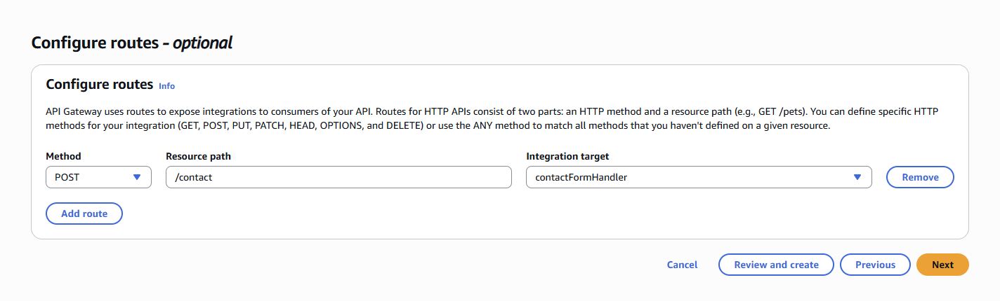

**Steg 7: Här kan du ange en stage för vår API, alltså ifall vi skapar en stage som heter prod så kan APIn nås via API-URL/prod/api**  
**Men vi väljer att köra $default för enkelhetensskull, detta resulterar med att vi kan nå vår API genom API-URL/api**


**Steg 8: Slutligen får vi en översikt över vår API med dess konfigurationer**  
**Välj därefter "Create"**

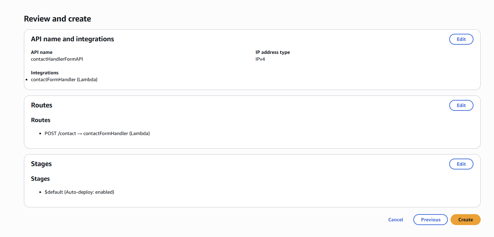

**Steg 9: Du bör nu ser vår nyskapade API som enligt bilden nedan:**

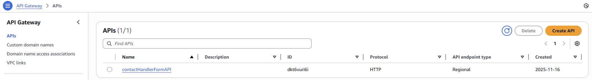

**Steg 10: Gå sedan in APIn och granska att vår Routes och Integrations har skapats korrekt:**

- **Routes:**

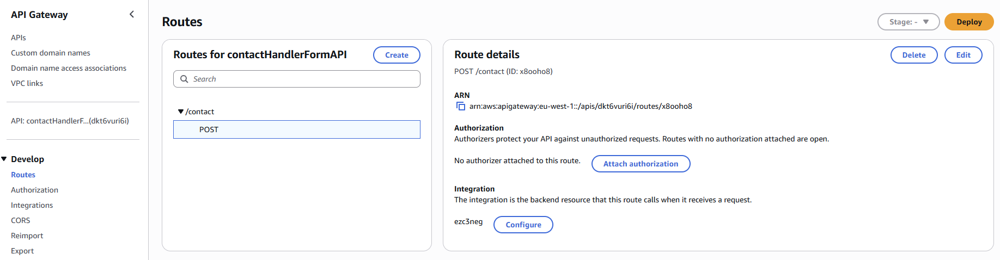

- **AWS Lambda Integration:**

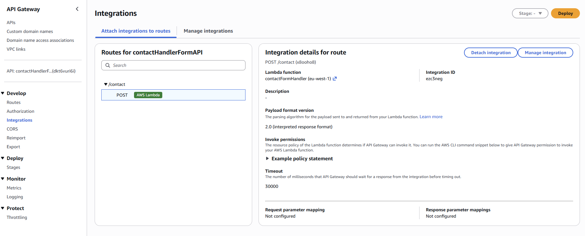

**Steg 11: Slutligen behöver vi sätta upp CORS så att vi Lambda-funktionen kan nås genom vår app**

Fyll i:
    - **Access-Control-Allow-Origin** – S3-bucket URL `http://serverless-bucket-2025.s3-website-eu-west-1.amazonaws.com/`
    - **Access-Control-Allow-Methods** – `POST`, `OPTIONS`
    - **Access-Control-Allow-Headers** - `content-type`
6. Spara med **"Save"**

- För tillfället anger vi vår S3-bucket URL, men vi kommer byta denna senare till cloudfront-url (såsom jag har det konfiguerat enligt bilden) när vi konfiguerat upp CloudFront.
- Detta gör att endast S3-domänen kan använda vår Lambda-funktion

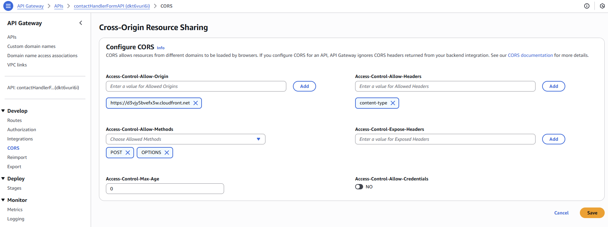

**Steg 12: Slutligen kopiera APIs "Default endpoint" och ersätt följande API-URL på raden i **contact_form.html** som innehåller:**

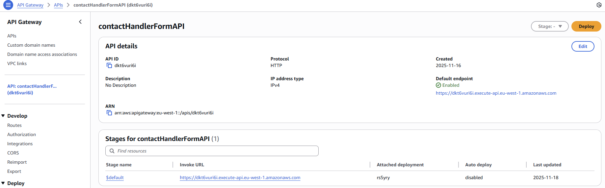

```bash
const apiUrl = "https://dkt6vuri6i.execute-api.eu-west-1.amazonaws.com/contact";
```

# Uppsättning av Amazon CloudFront som reverse proxy med HTTPS

Denna guide beskriver hur man konfigurerar Amazon CloudFront för att distribuera frontend-filer från S3 och ge säker åtkomst via HTTPS. Målet är att skapa en snabb, säker och skalbar distribution av webbapplikationens statiska innehåll. CloudFront fungerar som en reverse proxy som hanterar HTTPS-anslutningar, och som säkerställer att användare alltid får en pålitlig och krypterad anslutning till webbapplikationen.

**Steg 1: Bege dig till aws.amazon.com**


**Steg 2: Ange Cloudfront i sökrutan och välj "CloudFront - Global Content Delivery Network**

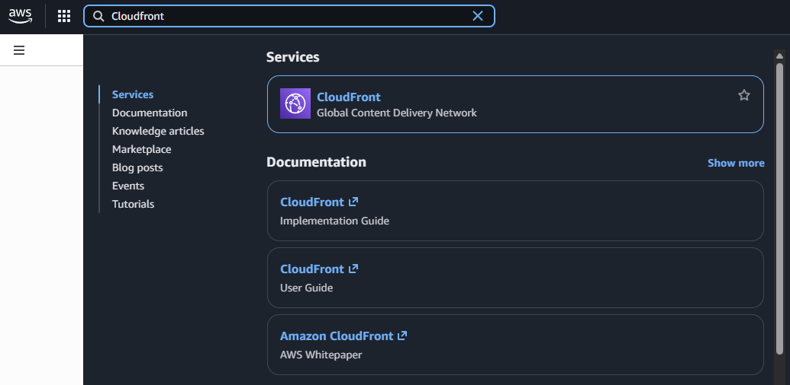

**Steg 3: Välj "Create a CloudFront distribution"**

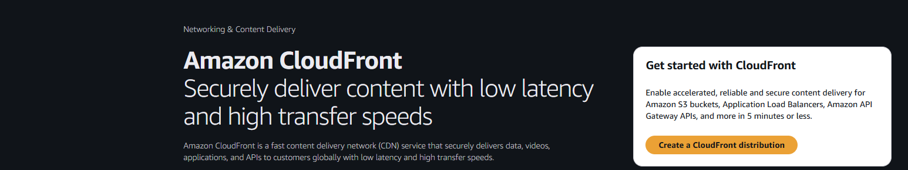

**Steg 4: För betalningsplan är enklast att välja pay-as-you-go för vårt ändamål eftersom vi kommer ändå inte hantera större mängder trafik**

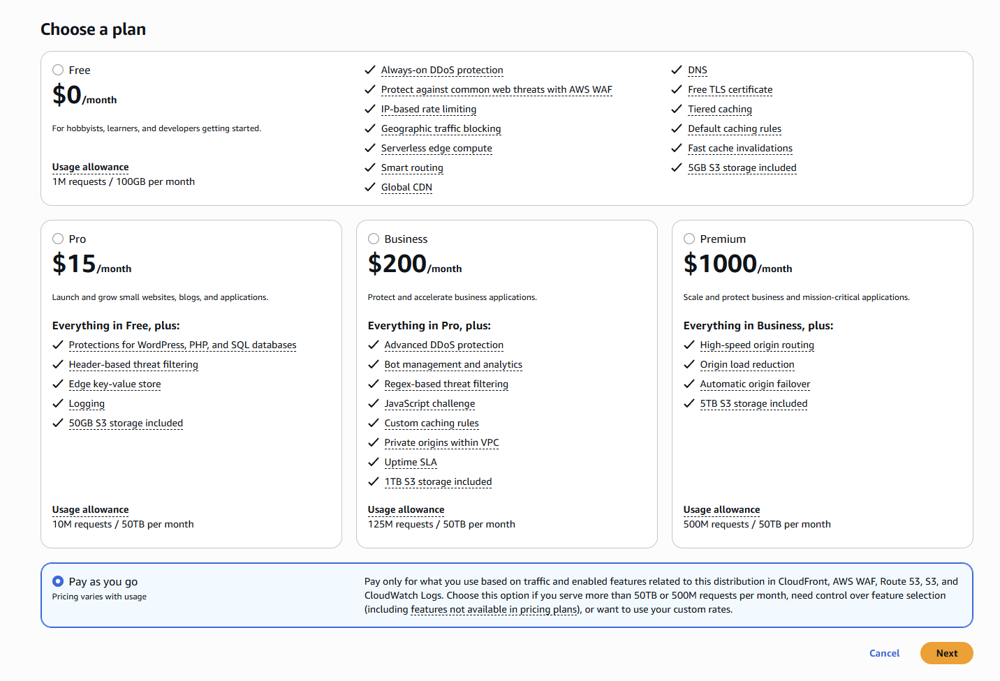

**Steg 5: Ange ett namn för vår CloudFront distribution, jag kommer namnge den serverless-app-cloudfront**

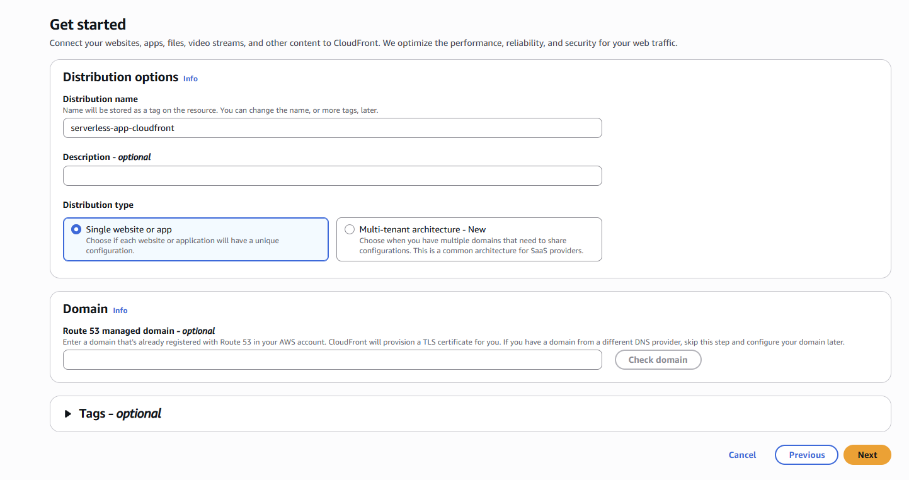

**Steg 6: Välj sedan Amazon S3 och bläddra fram vår S3-bucket. Resten kan du lämna som det är**

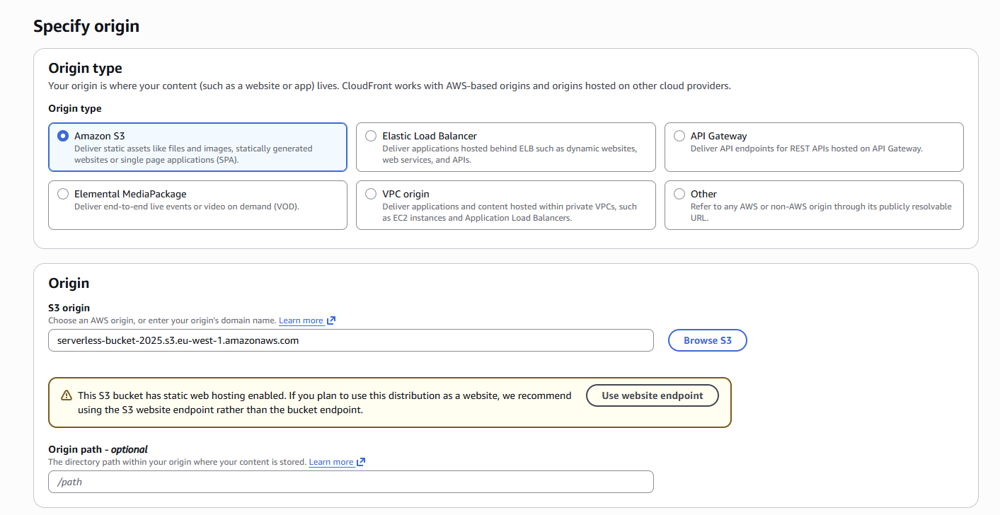

**Steg 7: Vi kan hoppa över att sätta upp säkerheten med WAF eftersom vår CloudFront är ändå endast i testnings-syfte**

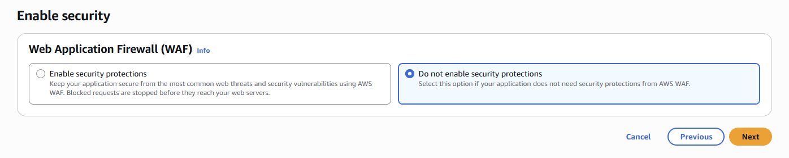

**Steg 8: Du får nu översikt över vår CloudFront distribution. Gå vidare genom att välja "Create distribution"**

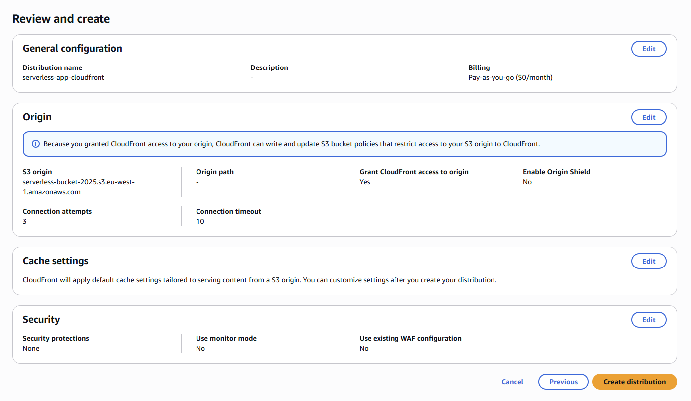

**Steg 9: Slutligen bör du se en översikt över CloudFront distributionen vi precis skapade**

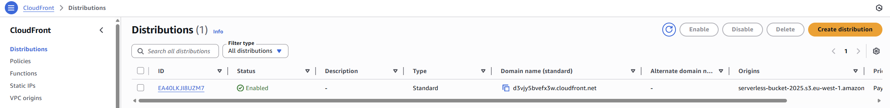

**Steg 10: Gå in på vår CloudFront Distribution och börja med att lägga till index.html för "Default root object" genom att navigera till "Edit" längst bort till höger**

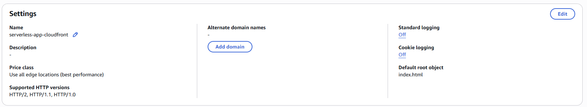

**Steg 11: Ange sedan "index.html" för "Default root object"**

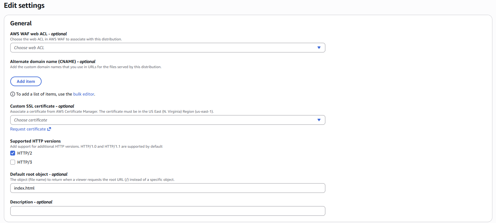

**Steg 12: Nu behöver vi lägga till vår API som vi skapade tidigare som en origin. Gör detta genom att navigera till Origins -> "Create origin"**

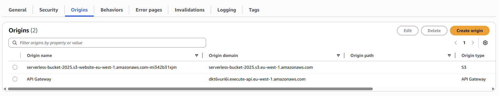

**Steg 13: Välj vår API Gateway i dropdown-listan när du väljer "Origin domain". Den kommer automatiskt generera din API-url som bilden nedan visar. Resten kan du lämna som det är**

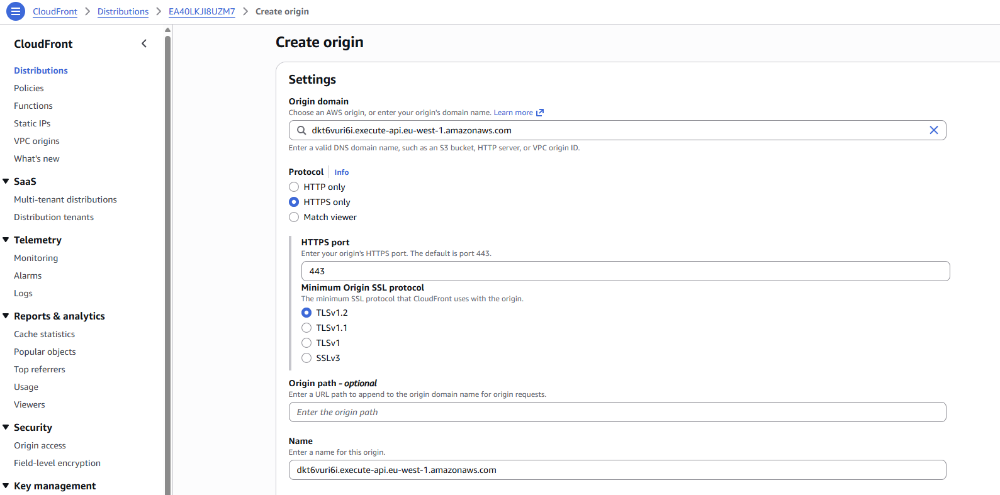

**Steg 14: Du bör nu ha två origins för din CloudFront distribution. En för din S3-bucket, och en för din API**

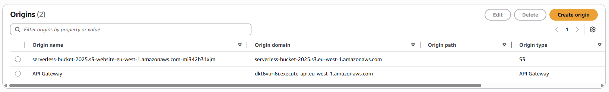

**Steg 15: Slutligen behöver vi även lägga till två behaviors. Återigen, en för din S3-bucket, och en för din API. Gör detta genom att navigera till Behaviors -> "Create behavior"**

Fyll i följande för S3-bucket:
    - **Path pattern** – `/`
    - **Origin and origin groups** – `Välj din S3-bucket`
    - **Viewer protocol policy** - `Redirect HTTP to HTTPS`
    - **Allowed HTTP methods** - `GET, HEAD`
    - **Cache policy** - `CachingOptimized`
   Spara med **"Save changes"**

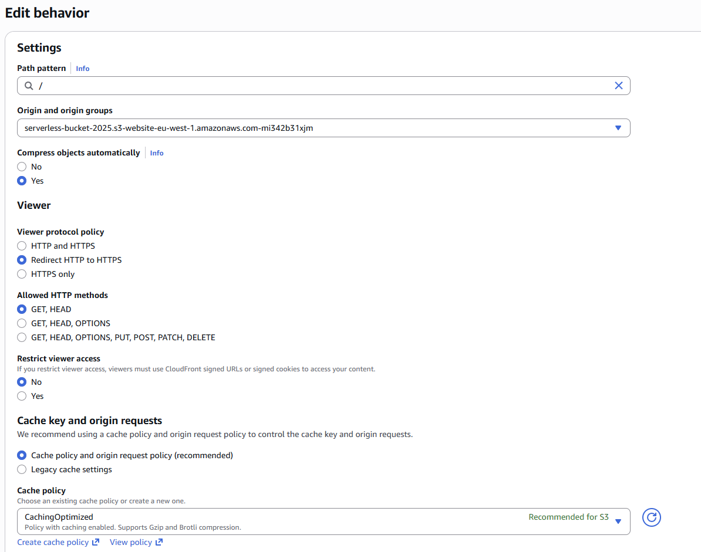

Fyll i följande för APIn
    - **Path pattern** – `/api/*`
    - **Origin and origin groups** – `Välj din API Gateway`
    - **Viewer protocol policy** - `HTTPS only`
    - **Allowed HTTP methods** - `GET, HEAD, OPTIONS, PUT, POST, PATCH, DELETE`
    - **Cache policy** - `CachingDisabled`
    - **Origin request policy** - `AllViewerExceptHostHeader`
   Spara med **"Save changes"**

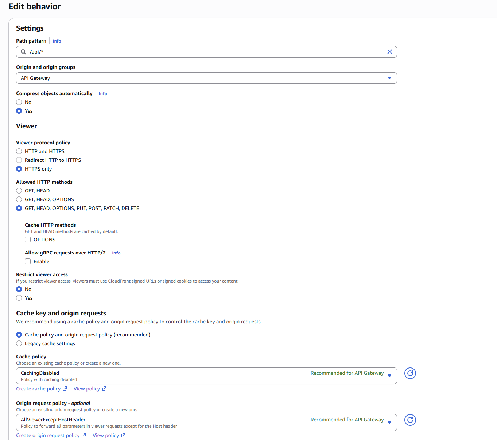

**Steg 16: Slutligen, ifall du redan ersatt API-URL på raden i **contact_form.html** som innehåller följande med din API**

```bash
const apiUrl = "https://dkt6vuri6i.execute-api.eu-west-1.amazonaws.com/contact";
```

**Så är det bara slutligen ersätta cloudfront-urlen som finns i contactFormHandler.js med din cloudfront-url**

# Uppsättning av AWS CodePipeline för CI/CD

Denna guide beskriver hur man skapar en CI/CD-pipeline med AWS CodePipeline kopplad till ett GitHub-repository. Målet är att automatisera bygg och deployment av både frontend-filer till S3 och backend-funktioner till Lambda. Den säkerställer att ändringar i koden automatiskt testas, byggs och distribueras, vilket gör att nya funktioner snabbt och på ett pålitligt sätt blir tillgängliga i produktionsmiljön.

**Steg 1: Bege dig till aws.amazon.com**


**Steg 2: Ange Codepipeline i sökrutan och välj "CodePipeline - Release Software using Continuous Delivery**

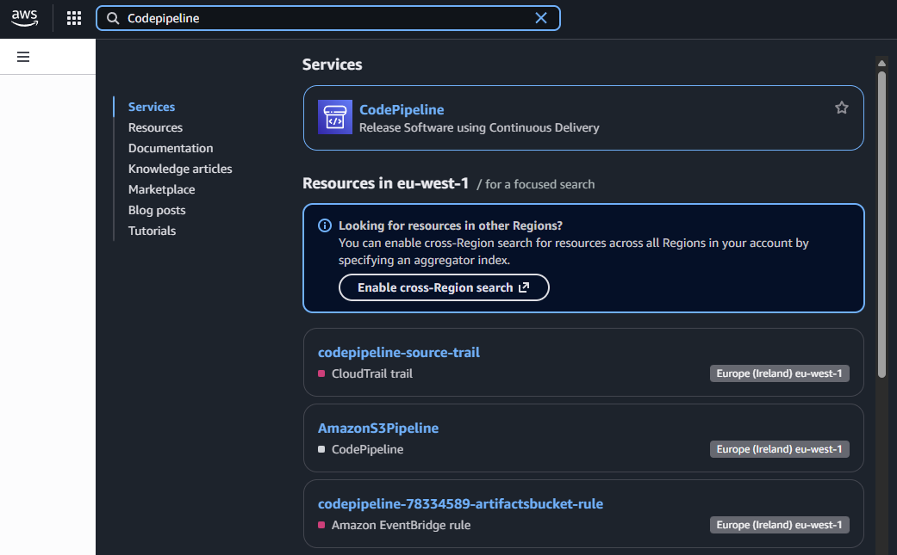

- Notera för att ansluta GitHub ihop med CodePipeline på AWS behövs följande connector: https://github.com/marketplace/aws-connector-for-github

**Steg 3: Välj "Create pipeline"**

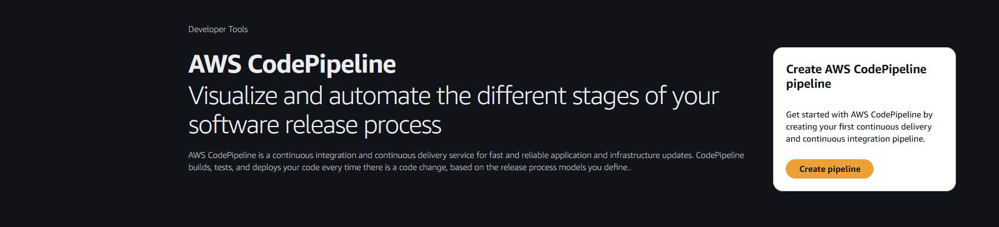

**Steg 4: Välj därefter "Build custom pipeline" under Category**

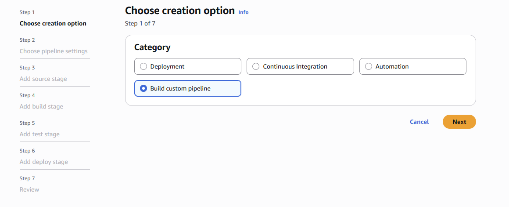

**Steg 5: Ange ett namn för vår CI/CD Pipeline, jag kommer namnge den AmazonS3Pipeline**

5. Välj/Fyll i även in följande:
    - **Execution Mode** – `Queued`
    - **New Service Role** – `Låt AWS CodePipeline skapa en IAM-roll åt dig med korrekta rättigheter`
6. Navigera sedan ner till **Advanced settings** och välj **Custom location**
- Du behöver nämligen ha en S3-bucket för att lagra dina artifacts.
- Skapa helt enkelt en S3-bucket som tidigare och ge den ett passande, jag döpte min till **artifacts-bucket-2025**
- Välj därefter din nyskapade S3-bucket för Custom location

**S3-artifacts i CI/CD** är helt enkelt filer som din bygg- och deployprocess sparar i ett tryggt förråd (Amazon S3) under arbetets gång.

Tänk dig att din CI/CD-pipeline bygger något — till exempel en app, en konfigurationsfil eller ett paket. Resultatet behöver sparas någonstans så att nästa steg i processen kan använda det.

Amazon S3 fungerar då som **en gemensam lagringsplats** där pipelinen kan lägga sina filer och hämta dem när de behövs.

**Kort sagt:**
S3-artifacts är filer som CI/CD-systemet lagrar i S3 så att de kan användas och delas mellan olika steg i automatiseringskedjan.

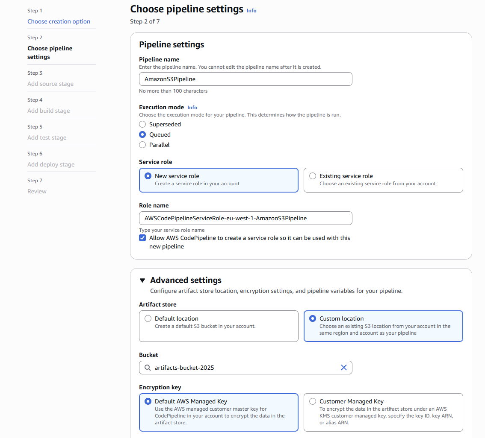

**Steg 6: När vi kommer till "Add source stage" är det dags att koppla samman vår GitHub-repo och AWS CodePipeline**

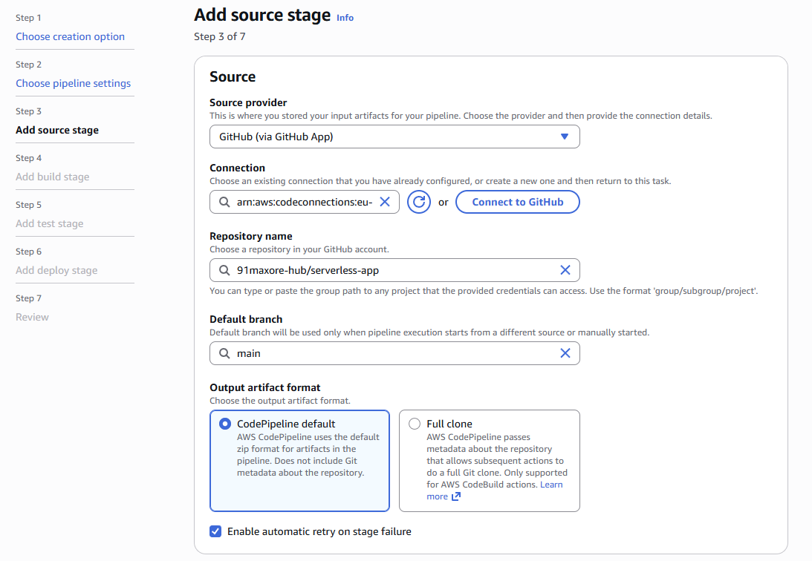

**Steg 7: "Add test stage" och "Add build stage" kan vi skippa**

**Steg 8: När vi kommer till "Add deploy stage" behöver vi tala om för AWS CodePipeline vilken S3-bucket det är som ska ingå i CI/CD deploymentprocessen genom att ange vår S3-bucket under "Bucket. Resten kan du lämna som det är**

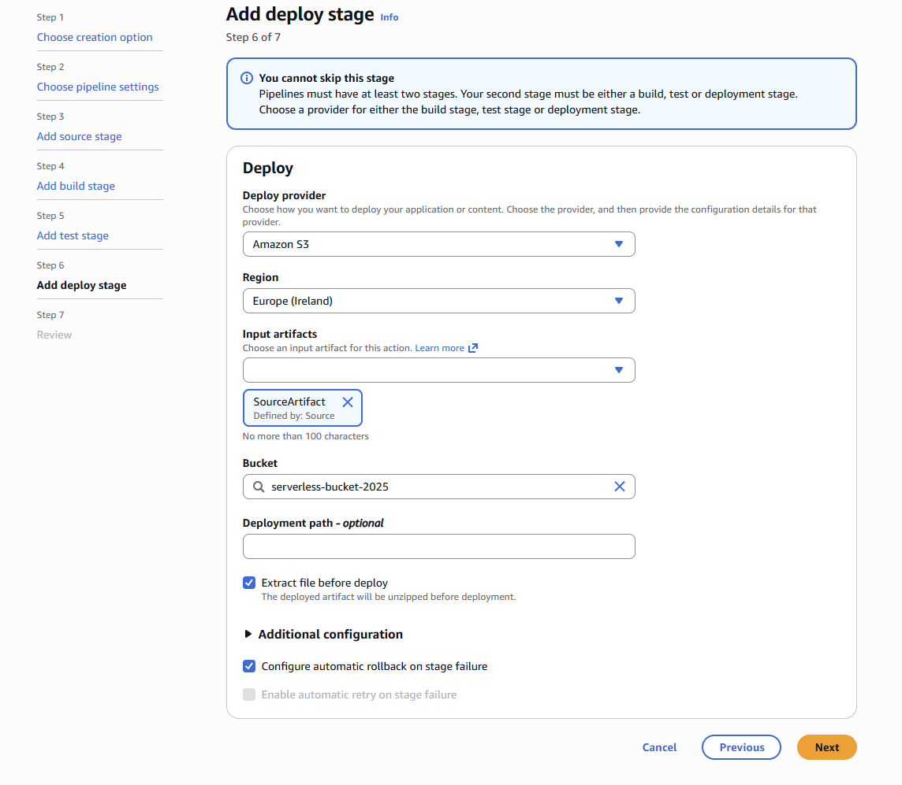

**Steg 9: Du får nu översikt över vår AWS CodePipeline. Gå vidare genom att välja "Create pipeline"**

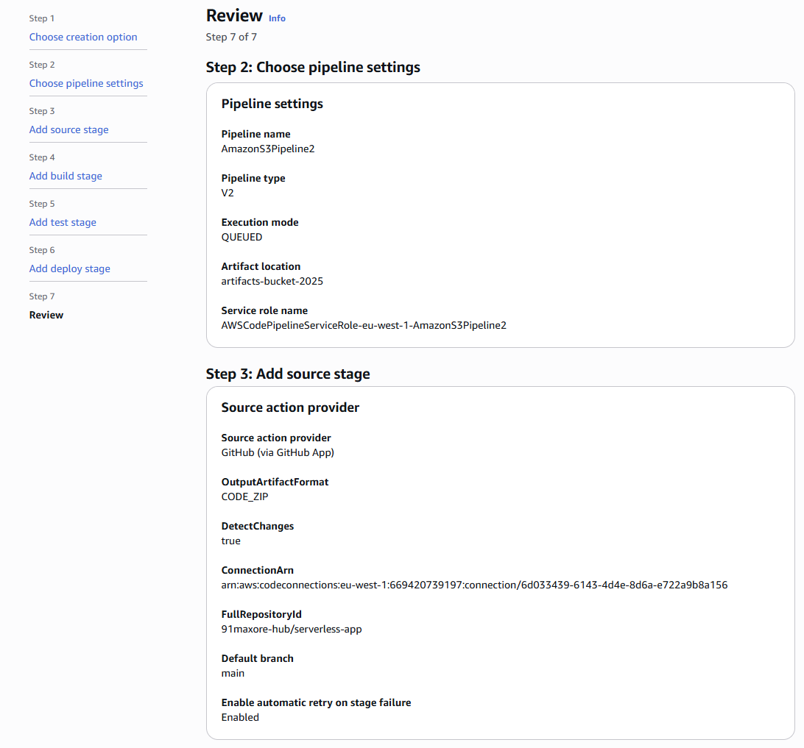

**Steg 10: Slutligen bör du se en översikt över AWS CodePipelinen vi precis skapade som kommer hantera CI/CD deployment**

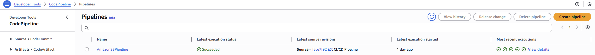

# ✅ Resultat

Efter att allt var uppsatt och CI/CD-deployment gick igenom kunde jag gå till:
🔗 https://d3vjy5bvefx3w.cloudfront.net

Min PHP-app laddas med giltigt SSL-certifikat, automatisk HTTPS och reverse proxy som hanterar trafiken smidigt genom CloudFront.
Allt detta sker helt automatiskt – både deployment och certifikatförnyelse.

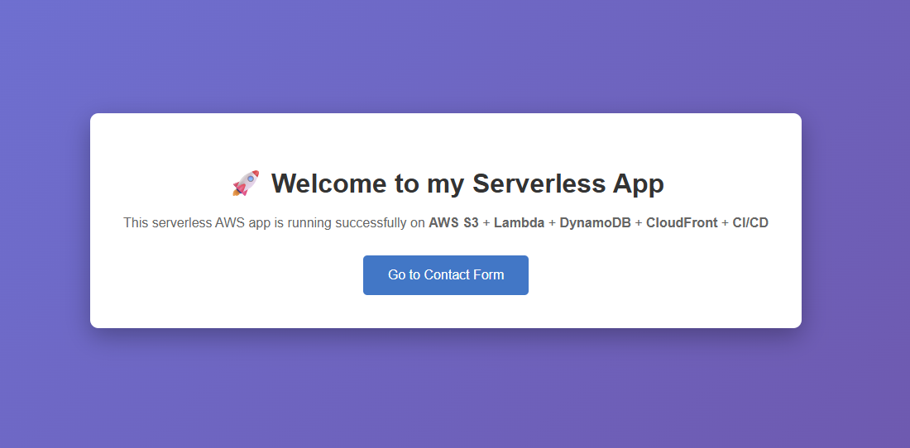