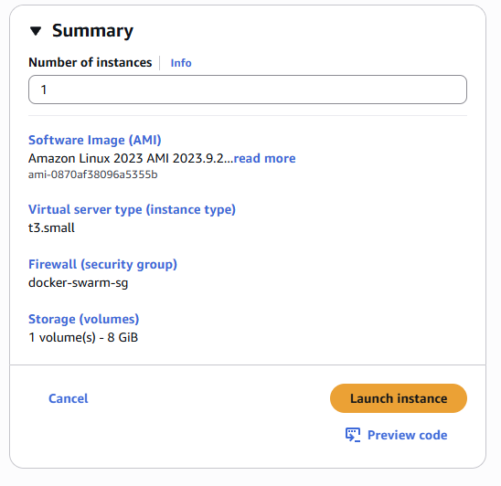

I detta projekt har jag byggt en skalbar och robust miljö för en webbapplikation med Docker Swarm på AWS. Miljön består av tre virtuella EC2-servrar, där en fungerar som manager och två som worker-noder. Applikationen, som är utvecklad med HTML, PHP och CSS, körs i tre separata containrar – en på varje server – vilket ger hög tillgänglighet och enkel skalning.

För att hantera inkommande trafik och säkerställa säkra anslutningar har jag implementerat Traefik som reverse proxy med stöd för HTTPS. För övervakning och visualisering av klustret används Docker Visualizer, vilket ger en tydlig överblick över vilka containrar som körs på vilka noder. Dessutom har jag kopplat CI/CD via GitHub, vilket gör att uppdateringar av applikationen automatiskt byggs och distribueras till klustret.

Denna lösning visar hur containerteknologi och molninfrastruktur kan kombineras för att skapa en flexibel, skalbar och lättunderhållen webbmiljö, samtidigt som den säkerställer säkerhet, pålitlighet och tydlig översikt över klustrets status.

Noterbart är att i detta projekt har jag utnyttjat följande molntjänster från AWS:

* **EC2 (Elastic Compute Cloud):** Tre virtuella servrar används för att köra Docker Swarm – en som manager och två som worker-noder.
* **GitHub:** För CI/CD, vilket möjliggör automatiska bygg och deployment av webbapplikationen.

Tillsammans skapar dessa tjänster en skalbar, flexibel och säker miljö för webbapplikationen.

| **Komponent**              | **Beskrivning**                                                             | **Användningsområde**                                 | **Kommentar**                                                            |
| -------------------------- | --------------------------------------------------------------------------- | ----------------------------------------------------- | ------------------------------------------------------------------------ |
| **EC2-servrar**            | Virtuella servrar i AWS som utgör infrastrukturen för Docker Swarm-klustret | Körning av applikationens containrar och Swarm-noder  | En server som manager, två som workers för skalbarhet och redundans      |
| **Docker Swarm**           | Containerorkestreringssystem som hanterar distribution av containrar        | Säkerställer att applikationen körs i flera noder     | Gör applikationen skalbar och tillgänglig även vid noder som går ner     |
| **Applikationscontainrar** | Containeriserad webbapplikation (HTML, PHP, CSS)                            | Kör själva webbapplikationen på Swarm-servrarna       | En container per server för hög tillgänglighet                           |
| **Traefik**                | Reverse proxy och load balancer med HTTPS-stöd                              | Hantering av inkommande trafik och säkra anslutningar | Automatiserar certifikat via HTTPS och styr trafiken till rätt container |
| **GitHub CI/CD**           | Automatiserat bygg- och deployflöde                                         | Uppdateringar och deployment av applikationen         | Säkerställer att nya versioner distribueras snabbt och pålitligt         |
| **Docker Visualizer**      | Grafiskt verktyg som visar status och fördelning av containrar i Swarm      | Övervakning och visualisering av Swarm-klustret       | Hjälper till att se vilka containrar som körs på vilka noder i realtid   |

**Regler för säkerhetsgruppen `docker-swarm-sg`**

| **Tillämpning / Resurser**   | **Tillåtna portar** | **Protokoll** | **Syfte**                                          |
| ---------------------------- | ------------------- | ------------- | -------------------------------------------------- |
| EC2-servrar i Swarm-klustret | 22                  | TCP           | SSH-åtkomst för administration                     |
| EC2-servrar i Swarm-klustret | 80                  | TCP           | HTTP-trafik till webbapplikationen                 |
| EC2-servrar i Swarm-klustret | 443                 | TCP           | HTTPS-trafik till webbapplikationen                |
| EC2-servrar i Swarm-klustret | 4789                | UDP           | Overlay Network för Swarm-tjänster                 |
| EC2-servrar i Swarm-klustret | 7946                | TCP           | Swarm intern kommunikation                         |
| EC2-servrar i Swarm-klustret | 7946                | UDP           | Swarm intern kommunikation                         |
| EC2-servrar i Swarm-klustret | 2377                | TCP           | Swarm management trafik mellan manager och workers |
| EC2-servrar i Swarm-klustret | 8080                | TCP           | Traefik – reverse proxy med dashboard              |
| EC2-servrar i Swarm-klustret | 8081                | TCP           | Docker Visualizer dashboard                        |

**Mapp struktur**

| Katalog / Fil                    | Typ  | Beskrivning                                          |
| -------------------------------- | ---- | ---------------------------------------------------- |
| **docker-swarm-app/**            | Mapp | Rotmappen för hela projektet.                        |
| ├── **Dockerfile**               | Fil  | Bygger Docker-imagen och definierar miljö/beroenden. |
| ├── **index.html**               | Fil  | Huvudsidan för webbapplikationen.                    |
| ├── **contact_form.html**        | Fil  | Sida med kontaktformulär.                            |
| ├── **process_contact_form.php** | Fil  | PHP-script som hanterar formulärdata.                |
| ├── **style.css**                | Fil  | CSS-stilmall för webbplatsen.                        |
| ├── **.github/workflows/**       | Mapp | Mapp för GitHub Actions workflows.                   |
|      └── **deploy.yml**          | Fil  | Workflow som hanterar CI/CD och deployment.          |


# Provisionera Amazon EC2-server

Denna guide beskriver hur man provisionerar Amazon EC2-instanser som ska ingå i ett Docker Swarm-kluster. Målet är att skapa en stabil och skalbar miljö med en Swarm Manager och två Swarm Workers. EC2-instanserna kommer att konfigureras med nödvändig nätverksåtkomst, säkerhetsgrupper och grundläggande systemkrav för att stödja containerorkestrering med Docker Swarm.

**Steg 1: Bege dig till aws.amazon.com**


**Steg 2: Ange EC2 i sökrutan och välj "EC2 - Virtual Servers in the Cloud"**


**Steg 3: Välj "Launch Instance"**


**Steg 4: Ange ett namn för din server, operativsystem (AMI), instanstyp, samt skapa SSH-nyckel för säker åtkomst.**


**Steg 5: Välj sedan säkerhetsgruppen (docker-swarm-sg) som ansvarar för vilka portar som ska användas för vårt Docker Swarm-kluster. Resten kan lämnas som det är.**


**Steg 6: Gå sedan längst ner till Advanced details -> User data och klistra in följande:**

```bash
#!/bin/bash
dnf update -y
dnf install -y docker
systemctl enable --now docker
usermod -aG docker ec2-user
```


**Steg 6: Du får sedan en kort översikt över EC2-servern längst upp till höger. Välj Launch instance.**



**Repetera nu likadant för swarm-worker-1 och swarm-worker-2**

**Steg 7: Du bör nu se en översikt som nedan för samtliga EC2-servrar som kommer används i vårt Docker Swarm-kluster.**


# Initiera Docker Swarm via SSH på swarm-manager

**Steg 1: Först behöver vi SSHa in på vår nyskapade EC2 genom att ange:**
```bash
ssh -i ~Downloads/swarm-manager-key.pem ec2-user@34.246.185.128
```
**Notera att du får ändra sökvägen till din SSH-nyckel, samt den publika IP-adress till din instans**

